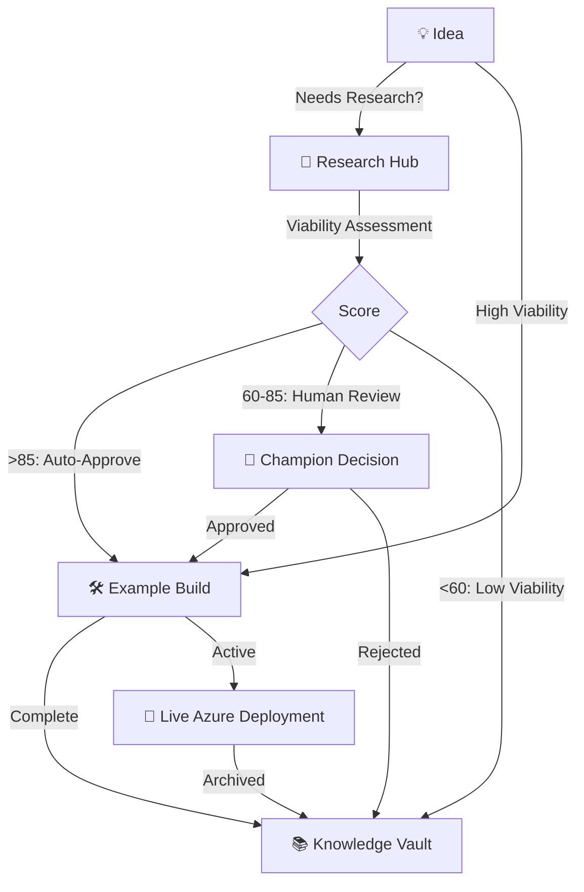

# Brookside BI Innovation Nexus

**An AI-powered innovation management platform designed to establish structured approaches for tracking ideas from concept through research, building, and knowledge archival.**

[](LICENSE)
[](https://azure.microsoft.com)
[](https://notion.so)
[](https://github.com)

---

## Overview

Brookside BI Innovation Nexus streamlines key workflows for innovation management through:

- **Notion-Centric Workspace**: 7 interconnected databases tracking ideas, research, builds, costs, and knowledge
- **Autonomous Build Pipeline**: Transform viable ideas into production-ready Azure applications in 40-60 minutes with minimal human intervention
- **Repository Safety Controls**: 3-layer protection system preventing credential leaks and enforcing quality standards
- **Cost Transparency**: Real-time software spend tracking with Microsoft-first optimization recommendations
- **AI Agent Orchestration**: 27+ specialized agents for research, analysis, code generation, and deployment
- **Microsoft Ecosystem First**: Prioritize Azure, M365, Power Platform, and GitHub solutions

**Best for**: Organizations scaling innovation workflows across teams who require enterprise-grade reliability, autonomous execution capabilities, and comprehensive cost visibility while maintaining sustainable development practices.

---

## Phase 3 Capabilities (Current)

### Autonomous Build Pipeline

**Transform ideas into live Azure applications in 40-60 minutes:**

1. **Parallel Research Swarm** (25-30 min): 4 specialized agents analyze market opportunity, technical feasibility, cost projections, and risk factors
2. **Automated Viability Assessment** (5 min): Composite scoring algorithm determines auto-approval, human review, or archival path
3. **Code Generation** (30-40 min): Production-quality FastAPI/Express/ASP.NET Core applications with tests and Azure integration
4. **Infrastructure Provisioning** (15-20 min): Bicep templates deploy App Services, SQL databases, Key Vault, and monitoring
5. **CI/CD Deployment** (10-15 min): GitHub Actions automate deployment with health checks and rollback procedures

**Time Reduction**: 95% improvement (2-4 weeks → 40-60 minutes)
**Cost Savings**: 87% reduction through environment-based SKU selection
**Human Intervention**: <5% for most workflows

### Repository Safety Hooks

**3-layer protection system securing all commits:**

- **Pre-Commit Hook**: Secret detection (15+ patterns), file size limits, Jupyter notebook sanitization
- **Commit-MSG Hook**: Conventional Commits enforcement, Brookside BI brand voice validation, length constraints
- **Branch Protection**: Prevent force pushes to main/master/production branches

**Deliverables**: 500-667% ROI through automated quality enforcement, $1,390-$1,540 monthly value via reduced security incidents

---

## Quick Start

### Prerequisites

**Required Software:**
- Azure CLI 2.50.0+
- Node.js 18.0.0+
- Git
- PowerShell 7.0+ (Windows)
- Claude Code (latest)

**Verify Installations:**
```powershell
az --version
node --version
git --version
pwsh --version
```

### Step 1: Azure Authentication

Establish secure connection to Azure Key Vault:

```powershell
# Login to Azure (browser authentication)
az login

# Set active subscription
az account set --subscription "cfacbbe8-a2a3-445f-a188-68b3b35f0c84"

# Verify Key Vault access
az keyvault secret list --vault-name kv-brookside-secrets
```

### Step 2: Configure Environment

Retrieve secrets from Azure Key Vault and set MCP environment variables:

```powershell
# Navigate to repository
cd C:\Users\MarkusAhling\Notion

# Configure environment (current session)
.\scripts\Set-MCPEnvironment.ps1

# OR configure persistent environment variables
.\scripts\Set-MCPEnvironment.ps1 -Persistent
```

### Step 3: Verify MCP Servers

Test connectivity to all 4 Model Context Protocol servers:

```powershell
# Test Azure MCP
.\scripts\Test-AzureMCP.ps1

# Verify all MCP servers connected
claude mcp list
```

**Expected Output**: All 4 servers show "✓ Connected"
- ✓ notion (Notion workspace integration)
- ✓ github (Repository operations)
- ✓ azure (Cloud services management)
- ✓ playwright (Browser automation and testing)

### Step 4: Install Repository Hooks (Optional)

Enforce code quality and security standards:

```powershell
# Simple installation (recommended for most users)
.\\.claude\hooks\Install-Hooks-Simple.ps1

# Advanced installation with custom configuration
.\\.claude\hooks\Install-Hooks.ps1 -SkipBackup -Force
```

### Step 5: Launch Claude Code

Start Claude Code with fully configured environment:

```powershell
claude
```

**Verification**: You should see all 4 MCP servers connected and be able to query Notion databases.

---

## Core Architecture

### Innovation Workflow



**Design Principles:**
- Status-driven, not timeline-driven
- Viability over deadlines
- Every build archived for future reference
- Cost transparency at all stages
- Microsoft ecosystem prioritized
- AI-agent executable documentation

### Notion Database Architecture

**7 Interconnected Databases:**

| Database | Purpose | Key Properties | Relations |
|----------|---------|----------------|-----------|
| 💡 **Ideas Registry** | Innovation starting point | Viability, Champion, Effort, Impact | Research, Builds, Software |
| 🔬 **Research Hub** | Feasibility investigation | Status, Viability Assessment, Next Steps | Ideas, Software |
| 🛠️ **Example Builds** | Working prototypes/demos | Build Type, Viability, Reusability, Monthly Cost | Ideas, Research, Software, Knowledge |
| 💰 **Software & Cost Tracker** | Financial hub | Cost, License Count, Category, Microsoft Service | ALL (central cost source) |
| 📚 **Knowledge Vault** | Archived learnings | Content Type, Evergreen/Dated | Ideas, Research, Builds |
| 🔗 **Integration Registry** | System connections | Integration Type, Auth Method, Security Review | Software, Builds |
| 🎯 **OKRs & Initiatives** | Alignment tracker | Status, Progress % | Ideas, Builds |

**Database IDs:**
- Ideas Registry: `984a4038-3e45-4a98-8df4-fd64dd8a1032`
- Research Hub: `91e8beff-af94-4614-90b9-3a6d3d788d4a`
- Example Builds: `a1cd1528-971d-4873-a176-5e93b93555f6`
- Software Tracker: `13b5e9de-2dd1-45ec-839a-4f3d50cd8d06`

---

## Key Features

### 1. Autonomous Innovation Pipeline

**Enable full automation for viable ideas:**

```bash
# Trigger autonomous workflow (research → build → deploy)
/autonomous:enable-idea <idea-name>

# Monitor real-time automation status
/autonomous:status

# View detailed pipeline activity
/autonomous:status --detailed
```

**Workflow Stages:**
1. **Research Swarm**: Parallel analysis (market, technical, cost, risk)
2. **Viability Scoring**: Automated decision logic (auto-approve, escalate, archive)
3. **Code Generation**: Production-ready application scaffolding
4. **Infrastructure**: Bicep templates provision Azure resources
5. **Deployment**: GitHub Actions deploy with health validation

### 2. Repository Portfolio Analysis

**Comprehensive GitHub organization visibility:**

```bash
# Full organization scan with Notion sync
/repo:scan-org --sync --deep

# Analyze single repository
/repo:analyze <repo-name> --sync

# Extract reusable patterns
/repo:extract-patterns --min-usage 3

# Calculate portfolio costs
/repo:calculate-costs --detailed
```

**Capabilities:**
- Multi-dimensional viability scoring (0-100)
- Claude Code maturity detection (Expert/Advanced/Intermediate/Basic/None)
- Cross-repository pattern mining
- Dependency cost aggregation
- Automated Notion synchronization

### 3. Cost Analysis & Optimization

**Real-time software spend tracking:**

```bash
# Comprehensive cost analysis
/cost:analyze all

# Identify unused tools
/cost:unused-software

# Find consolidation opportunities
/cost:consolidation-opportunities

# Check contract renewals
/cost:expiring-contracts

# Suggest Microsoft alternatives
/cost:microsoft-alternatives <software-name>
```

**Cost Transparency Features:**
- Real-time monthly/annual projections
- Category-based breakdowns
- Microsoft vs. third-party analysis
- ROI calculations for optimization

### 4. Knowledge Management

**Preserve organizational learnings:**

```bash
# Archive completed work with learnings
/knowledge:archive <item-name> <database>

# Search Knowledge Vault
# (via Notion MCP - semantic AI search)
```

**Content Types:**
- Tutorial: Step-by-step guides
- Case Study: Project stories with outcomes
- Technical Doc: Architecture and API specs
- Post-Mortem: What worked, what didn't
- Template: Reusable structures

---

## Specialized Agents

**27+ AI agents orchestrating innovation workflows:**

### Core Innovation Agents
- **@ideas-capture**: Capture opportunities with viability assessment
- **@research-coordinator**: Orchestrate parallel research swarms
- **@build-architect-v2**: Autonomous code generation and deployment orchestration
- **@code-generator**: Language-specific production code generation
- **@deployment-orchestrator**: Azure infrastructure provisioning and deployment
- **@viability-assessor**: Multi-dimensional feasibility evaluation
- **@cost-analyst**: Software spend analysis and optimization
- **@knowledge-curator**: Learning preservation and documentation

### Technical Specialists
- **@database-architect**: Azure SQL, Cosmos DB schema design
- **@integration-specialist**: Microsoft ecosystem connections
- **@github-repo-analyst**: Repository health assessment
- **@architect-supreme**: Enterprise architecture and ADR documentation

### Autonomous Research Agents
- **@market-researcher**: Market opportunity and competitive analysis
- **@technical-analyst**: Technology stack and feasibility assessment
- **@cost-feasibility-analyst**: Financial projections and ROI
- **@risk-assessor**: Risk identification and mitigation

### Utility Agents
- **@markdown-expert**: Technical documentation formatting
- **@mermaid-diagram-expert**: Architecture diagram generation
- **@notion-mcp-specialist**: Notion API troubleshooting
- **@workflow-router**: Team assignment and workload balancing

**Best for**: Teams requiring intelligent task delegation that maximizes specialized expertise while minimizing coordination overhead.

---

## Microsoft Ecosystem Integration

**Priority Order:**
1. **Microsoft 365**: Teams, SharePoint, OneNote, Outlook
2. **Azure Services**: OpenAI, Functions, SQL, DevOps, App Services
3. **Power Platform**: Power BI, Power Automate, Power Apps
4. **GitHub**: Enterprise repos, Actions, Projects
5. **Third-party**: Only if Microsoft doesn't offer solution

**Azure Infrastructure:**
- **Subscription**: Azure subscription 1 (`cfacbbe8-a2a3-445f-a188-68b3b35f0c84`)
- **Key Vault**: `kv-brookside-secrets` (centralized secret management)
- **GitHub Org**: `github.com/brookside-bi`

---

## Common Workflows

### Create New Idea

```bash
# Capture idea with automatic duplicate detection
/innovation:new-idea <description>

# Autonomous research and viability assessment
# (automatically triggered for "Needs Research" ideas)

# Enable full autonomous pipeline
/autonomous:enable-idea <idea-name>
```

### Quarterly Cost Review

```bash
# Comprehensive cost analysis
/cost:analyze all

# Find waste
/cost:unused-software

# Check renewals
/cost:expiring-contracts

# Identify consolidation
/cost:consolidation-opportunities
```

### Complete Build Lifecycle

```bash
# Create build entry
/innovation:create-build <name> <type>

# (Development occurs in GitHub/Azure)

# Archive with learnings
/knowledge:archive <build-name> build
```

---

## Configuration Files

**Critical Configuration:**
- `.claude/settings.local.json`: Personal Claude Code preferences (git-ignored)
- `.claude.json`: MCP server configuration and Notion workspace settings
- `.env.example`: Environment variable template
- `scripts/*.ps1`: Azure Key Vault and environment setup utilities

**Repository Hooks:**
- `.claude/hooks/pre-commit`: Secret detection, file validation
- `.claude/hooks/commit-msg`: Conventional Commits enforcement
- `.claude/hooks/pre-push`: Branch protection

---

## Troubleshooting

### MCP Server Connection Issues

```powershell
# Test Azure authentication
az account show

# Re-configure environment
.\scripts\Set-MCPEnvironment.ps1

# Test MCP servers
.\scripts\Test-AzureMCP.ps1

# Restart Claude Code
```

### Key Vault Access Denied

```powershell
# Verify permissions
az keyvault show --name kv-brookside-secrets

# Re-login if token expired
az login

# Contact Azure administrator for access
```

### Notion MCP Not Connected

```powershell
# Verify workspace ID in .claude.json
# Restart Claude Code to trigger OAuth

# Check connection status
claude mcp list
```

### GitHub Authentication Failing

```powershell
# Retrieve PAT from Key Vault
$env:GITHUB_PERSONAL_ACCESS_TOKEN = .\scripts\Get-KeyVaultSecret.ps1 -SecretName "github-personal-access-token"

# Configure Git credential helper
git config --global credential.helper store
```

---

## Project Structure

```
C:\Users\MarkusAhling\Notion\
├── .claude/                          # Claude Code configuration
│   ├── agents/                       # 27+ specialized agents
│   ├── commands/                     # Slash command definitions
│   │   ├── innovation/               # Idea, research, build commands
│   │   ├── cost/                     # Cost analysis commands
│   │   ├── knowledge/                # Archival commands
│   │   ├── team/                     # Workflow routing
│   │   ├── repo/                     # Repository analysis
│   │   ├── autonomous/               # Autonomous pipeline
│   │   └── compliance/               # Compliance audit
│   ├── docs/
│   │   └── patterns/                 # 4 architectural patterns
│   ├── templates/                    # ADR, Runbook, Research templates
│   ├── hooks/                        # Git repository safety hooks
│   └── settings.local.json           # Personal settings (git-ignored)
├── scripts/                          # PowerShell automation scripts
│   ├── Get-KeyVaultSecret.ps1        # Retrieve individual secrets
│   ├── Set-MCPEnvironment.ps1        # Configure MCP environment
│   └── Test-AzureMCP.ps1             # Validate MCP connectivity
├── brookside-repo-analyzer/          # Repository portfolio analysis tool
├── CLAUDE.md                         # Comprehensive project documentation
├── README.md                         # This file
└── .env.example                      # Environment variable template
```

---

## Documentation

**Key Documentation Files:**
- `CLAUDE.md`: Comprehensive guide for Claude Code agents and users (26,000+ words)
- `.claude/agents/*.md`: Individual agent specifications
- `.claude/commands/*/*.md`: Slash command documentation
- `.claude/docs/patterns/*.md`: Architectural pattern implementations
- `.claude/templates/*.md`: Reusable documentation templates

**External Resources:**
- [Notion Workspace](https://notion.so/brookside-bi) (requires authentication)
- [GitHub Organization](https://github.com/brookside-bi)
- [Azure Portal](https://portal.azure.com)

---

## Team Structure

**Specializations:**
- **Markus Ahling**: Engineering, Operations, AI, Infrastructure
- **Brad Wright**: Sales, Business, Finance, Marketing
- **Stephan Densby**: Operations, Continuous Improvement, Research
- **Alec Fielding**: DevOps, Engineering, Security, Integrations, R&D, Infrastructure
- **Mitch Bisbee**: DevOps, Engineering, ML, Master Data, Quality

**Champion Assignment**: Ideas and builds are automatically assigned based on specialization matching.

---

## Contributing

This repository follows enterprise-grade development practices:

**Branch Strategy:**
- `main`: Production-ready code
- `feature/[description]`: New features
- `fix/[description]`: Bug fixes
- `docs/[description]`: Documentation updates

**Commit Standards:**
- Use Conventional Commits format
- Apply Brookside BI brand voice (professional, solution-focused)
- Include Claude Code co-authorship attribution

**Quality Standards:**
- Repository hooks enforce secret detection and commit message format
- All builds require comprehensive tests and AI-agent executable documentation
- Cost tracking mandatory for all software dependencies

---

## Support

**Contact:**
- Email: Consultations@BrooksideBI.com
- Phone: +1 209 487 2047

**Issue Reporting:**
- GitHub Issues (for technical bugs)
- Notion Comments (for workflow questions)

---

## License

MIT License - See [LICENSE](LICENSE) file for details.

---

## Acknowledgments

Built with:
- [Claude Code](https://claude.ai/code) by Anthropic
- [Notion](https://notion.so) workspace management
- [Azure](https://azure.microsoft.com) cloud infrastructure
- [GitHub](https://github.com) version control
- Model Context Protocol (MCP) for seamless integrations

**Powered by AI-driven innovation management** - transforming ideas into production-ready solutions through autonomous agent orchestration and enterprise-grade reliability.

---

**Last Updated**: October 2025
**Version**: Phase 3 (Autonomous Build Pipeline + Repository Safety Controls)
