# Brookside BI Innovation Nexus

**Purpose-built SaaS platform foundation for organizations scaling innovation workflows across teams. Streamline idea-to-production lifecycle with autonomous agent orchestration, comprehensive cost tracking, and Microsoft ecosystem integration.**

[](LICENSE)
[](https://azure.microsoft.com)
[](https://notion.so)
[](https://github.com)

---

## Platform Statistics

**At a Glance:**
- **56 Specialized Agents** - Autonomous research, code generation, deployment, analysis
- **71 Slash Commands** - Complete automation across innovation lifecycle
- **11 Notion Databases** - Interconnected tracking from idea to knowledge
- **4 MCP Servers** - Notion, GitHub, Azure, Playwright integration
- **3-Layer Safety** - Pre-commit, commit-msg, branch protection hooks
- **148 Code Files** - TypeScript, Python, PowerShell automation scripts
- **40-60 Minutes** - Idea to live Azure deployment (autonomous pipeline)
- **87% Cost Savings** - Environment-based SKU optimization

---

## Overview

Brookside BI Innovation Nexus drives measurable outcomes through:

- **Notion-Centric Workspace**: 11 interconnected databases tracking ideas, research, builds, costs, knowledge, integrations, agents, and OKRs
- **Autonomous Build Pipeline**: Transform viable ideas into production-ready Azure applications in 40-60 minutes with minimal human intervention
- **Repository Safety Controls**: 3-layer protection system preventing credential leaks and enforcing quality standards
- **Cost Transparency**: Real-time software spend tracking with Microsoft-first optimization recommendations
- **AI Agent Orchestration**: 56 specialized agents for research, analysis, code generation, deployment, and knowledge management
- **Microsoft Ecosystem First**: Prioritize Azure, M365, Power Platform, and GitHub solutions
- **71 Slash Commands**: Comprehensive automation across innovation lifecycle, cost analysis, and team coordination

**Best for**: Organizations scaling innovation workflows across teams who require enterprise-grade reliability, autonomous execution capabilities, and comprehensive cost visibility while maintaining sustainable development practices.

**Visual Architecture: System Components & Integrations**

```mermaid
C4Context
    title Brookside BI Innovation Nexus - System Architecture

    Person(user, "Innovation Team", "Team members, researchers, and developers")

    System_Boundary(nexus, "Innovation Nexus") {
        System(claude, "Claude Code", "AI agent orchestration with 56 specialized agents")
        System(hooks, "Repository Hooks", "3-layer quality enforcement (pre-commit, commit-msg, branch protection)")
        System(scripts, "Automation Scripts", "71 slash commands automating innovation workflows")
    }

    System_Ext(notion, "Notion Workspace", "Central hub: 11 databases tracking ideas, research, builds, costs, knowledge, integrations, agents, OKRs")
    System_Ext(azure, "Azure Cloud", "App Services, Functions, Key Vault, SQL, Application Insights, APIM")
    System_Ext(github, "GitHub", "Source control, Actions CI/CD, organization repositories")
    System_Ext(playwright, "Playwright", "Browser automation for web testing and scraping")

    Rel(user, claude, "Delegates work to", "Natural language commands, slash commands")
    Rel(claude, notion, "Reads/writes data via", "Notion MCP (OAuth)")
    Rel(claude, azure, "Provisions infrastructure via", "Azure MCP (Azure CLI)")
    Rel(claude, github, "Manages repositories via", "GitHub MCP (PAT)")
    Rel(claude, playwright, "Automates browser via", "Playwright MCP")

    Rel(hooks, github, "Enforces quality on", "Git commits and pushes")
    Rel(scripts, azure, "Configures environment from", "Azure Key Vault secrets")
    Rel(scripts, claude, "Prepares environment for", "MCP server connections")

    Rel(notion, azure, "Triggers deployments to", "Webhook + Azure Functions")
    Rel(github, azure, "Deploys applications to", "GitHub Actions → App Services")
    Rel(azure, notion, "Syncs activity logs to", "Agent Activity Hub")

    UpdateLayoutConfig($c4ShapeInRow="3", $c4BoundaryInRow="1")
```



*Figure 1: System architecture showing Claude Code as orchestrator connecting Notion (data hub), Azure (infrastructure), GitHub (source control), and Playwright (automation) via MCP servers. 56 specialized agents and 71 slash commands provide comprehensive workflow automation.*

---

## Phase 3 Capabilities (Current)

### Autonomous Build Pipeline

**Transform ideas into live Azure applications in 40-60 minutes:**

1. **Parallel Research Swarm** (25-30 min): 4 specialized agents analyze market opportunity, technical feasibility, cost projections, and risk factors
2. **Automated Viability Assessment** (5 min): Composite scoring algorithm determines auto-approval, human review, or archival path
3. **Code Generation** (30-40 min): Production-quality FastAPI/Express/ASP.NET Core applications with tests and Azure integration
4. **Infrastructure Provisioning** (15-20 min): Bicep templates deploy App Services, SQL databases, Key Vault, and monitoring
5. **CI/CD Deployment** (10-15 min): GitHub Actions automate deployment with health checks and rollback procedures

**Time Reduction**: 95% improvement (2-4 weeks → 40-60 minutes)
**Cost Savings**: 87% reduction through environment-based SKU selection
**Human Intervention**: <5% for most workflows

### Repository Safety Hooks

**3-layer protection system securing all commits:**

- **Pre-Commit Hook**: Secret detection (15+ patterns), file size limits, Jupyter notebook sanitization
- **Commit-MSG Hook**: Conventional Commits enforcement, Brookside BI brand voice validation, length constraints
- **Branch Protection**: Prevent force pushes to main/master/production branches

**Deliverables**: 500-667% ROI through automated quality enforcement, $1,390-$1,540 monthly value via reduced security incidents

---

## Quick Start

### Prerequisites

**Required Software:**
- Azure CLI 2.50.0+
- Node.js 18.0.0+
- Git
- PowerShell 7.0+ (Windows)
- Claude Code (latest)

**Verify Installations:**
```powershell
az --version
node --version
git --version
pwsh --version
```

### Step 1: Azure Authentication

Establish secure connection to Azure Key Vault:

```powershell
# Login to Azure (browser authentication)
az login

# Set active subscription
az account set --subscription "cfacbbe8-a2a3-445f-a188-68b3b35f0c84"

# Verify Key Vault access
az keyvault secret list --vault-name kv-brookside-secrets
```

### Step 2: Configure Environment

Retrieve secrets from Azure Key Vault and set MCP environment variables:

```powershell
# Navigate to repository
cd C:\Users\MarkusAhling\Notion

# Configure environment (current session)
.\scripts\Set-MCPEnvironment.ps1

# OR configure persistent environment variables
.\scripts\Set-MCPEnvironment.ps1 -Persistent
```

### Step 3: Verify MCP Servers

Test connectivity to all 4 Model Context Protocol servers:

```powershell
# Test Azure MCP
.\scripts\Test-AzureMCP.ps1

# Verify all MCP servers connected
claude mcp list
```

**Expected Output**: All 4 servers show "✓ Connected"
- ✓ notion (Notion workspace integration)
- ✓ github (Repository operations)
- ✓ azure (Cloud services management)
- ✓ playwright (Browser automation and testing)

### Step 4: Install Repository Hooks (Optional)

Enforce code quality and security standards:

```powershell
# Simple installation (recommended for most users)
.\\.claude\hooks\Install-Hooks-Simple.ps1

# Advanced installation with custom configuration
.\\.claude\hooks\Install-Hooks.ps1 -SkipBackup -Force
```

### Step 5: Launch Claude Code

Start Claude Code with fully configured environment:

```powershell
claude
```

**Verification**: You should see all 4 MCP servers connected and be able to query Notion databases.

---

## Core Architecture

### Innovation Workflow

```mermaid
graph TD
    A[💡 Idea] -->|Needs Research?| B[🔬 Research Hub]
    A -->|High Viability| E[🛠️ Example Build]
    B -->|Viability Assessment| C{Score}
    C -->|>85: Auto-Approve| E
    C -->|60-85: Human Review| D[👤 Champion Decision]
    C -->|<60: Low Viability| F[📚 Knowledge Vault]
    D -->|Approved| E
    D -->|Rejected| F
    E -->|Complete| F
    E -->|Active| G[🚀 Live Azure Deployment]
    G -->|Archived| F
```



**Design Principles:**
- Status-driven, not timeline-driven
- Viability over deadlines
- Every build archived for future reference
- Cost transparency at all stages
- Microsoft ecosystem prioritized
- AI-agent executable documentation

### Notion Database Architecture

**11 Interconnected Databases:**

| Database | Purpose | Key Properties | Relations |
|----------|---------|----------------|-----------|
| 💡 **Ideas Registry** | Innovation starting point | Viability, Champion, Effort, Impact | Research, Builds, Software |
| 🔬 **Research Hub** | Feasibility investigation | Status, Viability Assessment, Next Steps | Ideas, Software |
| 🛠️ **Example Builds** | Working prototypes/demos | Build Type, Viability, Reusability, Monthly Cost | Ideas, Research, Software, Knowledge |
| 💰 **Software & Cost Tracker** | Financial hub | Cost, License Count, Category, Microsoft Service | ALL (central cost source) |
| 📚 **Knowledge Vault** | Archived learnings | Content Type, Evergreen/Dated | Ideas, Research, Builds |
| 🔗 **Integration Registry** | System connections | Integration Type, Auth Method, Security Review | Software, Builds |
| 🎯 **OKRs & Initiatives** | Alignment tracker | Status, Progress % | Ideas, Builds |
| 🤖 **Agent Registry** | AI agent catalog | Specialization, Status, Avg Duration | Activity Hub |
| 📊 **Agent Activity Hub** | Agent work tracking | Session, Duration, Deliverables | Agents, Ideas, Research, Builds |
| 🎨 **Output Styles Registry** | Communication styles | Target Audience, Tone | Agents |
| 🎬 **Actions Registry** | Slash command catalog | Command Name, Parameters, Description | Agents |

**Core Database IDs:**
- Ideas Registry: `984a4038-3e45-4a98-8df4-fd64dd8a1032`
- Research Hub: `91e8beff-af94-4614-90b9-3a6d3d788d4a`
- Example Builds: `a1cd1528-971d-4873-a176-5e93b93555f6`
- Software Tracker: `13b5e9de-2dd1-45ec-839a-4f3d50cd8d06`
- Agent Registry: `5863265b-eeee-45fc-ab1a-4206d8a523c6`
- Agent Activity Hub: `7163aa38-f3d9-444b-9c674-bde61868bd2b`
- Actions Registry: `64697e8c-0d51-4c10-b6ee-a6f643f0fc1c`

---

## Key Features

### 1. Autonomous Innovation Pipeline

**Enable full automation for viable ideas:**

```bash
# Trigger autonomous workflow (research → build → deploy)
/autonomous:enable-idea <idea-name>

# Monitor real-time automation status
/autonomous:status

# View detailed pipeline activity
/autonomous:status --detailed
```

**Workflow Stages:**
1. **Research Swarm**: Parallel analysis (market, technical, cost, risk)
2. **Viability Scoring**: Automated decision logic (auto-approve, escalate, archive)
3. **Code Generation**: Production-ready application scaffolding
4. **Infrastructure**: Bicep templates provision Azure resources
5. **Deployment**: GitHub Actions deploy with health validation

### 2. Repository Portfolio Analysis

**Comprehensive GitHub organization visibility:**

```bash
# Full organization scan with Notion sync
/repo:scan-org --sync --deep

# Analyze single repository
/repo:analyze <repo-name> --sync

# Extract reusable patterns
/repo:extract-patterns --min-usage 3

# Calculate portfolio costs
/repo:calculate-costs --detailed
```

**Capabilities:**
- Multi-dimensional viability scoring (0-100)
- Claude Code maturity detection (Expert/Advanced/Intermediate/Basic/None)
- Cross-repository pattern mining
- Dependency cost aggregation
- Automated Notion synchronization

### 3. Cost Analysis & Optimization

**Real-time software spend tracking:**

```bash
# Comprehensive cost analysis
/cost:analyze all

# Identify unused tools
/cost:unused-software

# Find consolidation opportunities
/cost:consolidation-opportunities

# Check contract renewals
/cost:expiring-contracts

# Suggest Microsoft alternatives
/cost:microsoft-alternatives <software-name>
```

**Cost Transparency Features:**
- Real-time monthly/annual projections
- Category-based breakdowns
- Microsoft vs. third-party analysis
- ROI calculations for optimization

### 4. Knowledge Management

**Preserve organizational learnings:**

```bash
# Archive completed work with learnings
/knowledge:archive <item-name> <database>

# Search Knowledge Vault
# (via Notion MCP - semantic AI search)
```

**Content Types:**
- Tutorial: Step-by-step guides
- Case Study: Project stories with outcomes
- Technical Doc: Architecture and API specs
- Post-Mortem: What worked, what didn't
- Template: Reusable structures

---

## Specialized Agents

**56 AI agents orchestrating innovation workflows:**

### Core Innovation Agents
- **@ideas-capture**: Capture opportunities with viability assessment
- **@research-coordinator**: Orchestrate parallel research swarms
- **@build-architect-v2**: Autonomous code generation and deployment orchestration
- **@code-generator**: Language-specific production code generation
- **@deployment-orchestrator**: Azure infrastructure provisioning and deployment
- **@viability-assessor**: Multi-dimensional feasibility evaluation
- **@cost-analyst**: Software spend analysis and optimization
- **@knowledge-curator**: Learning preservation and documentation

### Technical Specialists
- **@database-architect**: Azure SQL, Cosmos DB schema design
- **@integration-specialist**: Microsoft ecosystem connections
- **@github-repo-analyst**: Repository health assessment
- **@architect-supreme**: Enterprise architecture and ADR documentation

### Autonomous Research Agents
- **@market-researcher**: Market opportunity and competitive analysis
- **@technical-analyst**: Technology stack and feasibility assessment
- **@cost-feasibility-analyst**: Financial projections and ROI
- **@risk-assessor**: Risk identification and mitigation

### Utility Agents
- **@markdown-expert**: Technical documentation formatting
- **@mermaid-diagram-expert**: Architecture diagram generation
- **@notion-mcp-specialist**: Notion API troubleshooting
- **@workflow-router**: Team assignment and workload balancing

**Best for**: Teams requiring intelligent task delegation that maximizes specialized expertise while minimizing coordination overhead.

---

## Microsoft Ecosystem Integration

**Priority Order:**
1. **Microsoft 365**: Teams, SharePoint, OneNote, Outlook
2. **Azure Services**: OpenAI, Functions, SQL, DevOps, App Services
3. **Power Platform**: Power BI, Power Automate, Power Apps
4. **GitHub**: Enterprise repos, Actions, Projects
5. **Third-party**: Only if Microsoft doesn't offer solution

**Azure Infrastructure:**
- **Subscription**: Azure subscription 1 (`cfacbbe8-a2a3-445f-a188-68b3b35f0c84`)
- **Key Vault**: `kv-brookside-secrets` (centralized secret management)
- **GitHub Org**: `github.com/brookside-bi`

---

## Common Workflows

### Create New Idea

```bash
# Capture idea with automatic duplicate detection
/innovation:new-idea <description>

# Autonomous research and viability assessment
# (automatically triggered for "Needs Research" ideas)

# Enable full autonomous pipeline
/autonomous:enable-idea <idea-name>
```

### Quarterly Cost Review

```bash
# Comprehensive cost analysis
/cost:analyze all

# Find waste
/cost:unused-software

# Check renewals
/cost:expiring-contracts

# Identify consolidation
/cost:consolidation-opportunities
```

### Complete Build Lifecycle

```bash
# Create build entry
/innovation:create-build <name> <type>

# (Development occurs in GitHub/Azure)

# Archive with learnings
/knowledge:archive <build-name> build
```

---

## Configuration Files

**Critical Configuration:**
- `.claude/settings.local.json`: Personal Claude Code preferences (git-ignored)
- `.claude.json`: MCP server configuration and Notion workspace settings
- `.env.example`: Environment variable template
- `scripts/*.ps1`: Azure Key Vault and environment setup utilities

**Repository Hooks:**
- `.claude/hooks/pre-commit`: Secret detection, file validation
- `.claude/hooks/commit-msg`: Conventional Commits enforcement
- `.claude/hooks/pre-push`: Branch protection

---

## Troubleshooting

### MCP Server Connection Issues

```powershell
# Test Azure authentication
az account show

# Re-configure environment
.\scripts\Set-MCPEnvironment.ps1

# Test MCP servers
.\scripts\Test-AzureMCP.ps1

# Restart Claude Code
```

### Key Vault Access Denied

```powershell
# Verify permissions
az keyvault show --name kv-brookside-secrets

# Re-login if token expired
az login

# Contact Azure administrator for access
```

### Notion MCP Not Connected

```powershell
# Verify workspace ID in .claude.json
# Restart Claude Code to trigger OAuth

# Check connection status
claude mcp list
```

### GitHub Authentication Failing

```powershell
# Retrieve PAT from Key Vault
$env:GITHUB_PERSONAL_ACCESS_TOKEN = .\scripts\Get-KeyVaultSecret.ps1 -SecretName "github-personal-access-token"

# Configure Git credential helper
git config --global credential.helper store
```

---

## Project Structure

```
C:\Users\MarkusAhling\Notion\
├── .claude/                          # Claude Code configuration
│   ├── agents/                       # 56 specialized agents
│   ├── commands/                     # 71 slash command definitions
│   │   ├── innovation/               # Idea, research, build commands (4)
│   │   ├── cost/                     # Cost analysis commands (14)
│   │   ├── knowledge/                # Archival commands (1)
│   │   ├── team/                     # Workflow routing (1)
│   │   ├── repo/                     # Repository analysis (4)
│   │   ├── autonomous/               # Autonomous pipeline (2)
│   │   ├── agent/                    # Agent activity tracking (8)
│   │   ├── style/                    # Output style testing (3)
│   │   ├── docs/                     # Documentation management (3)
│   │   ├── build/                    # Build management (3)
│   │   ├── idea/                     # Idea management (3)
│   │   ├── research/                 # Research management (2)
│   │   ├── action/                   # Actions registry (1)
│   │   └── compliance/               # Compliance audit (1)
│   ├── docs/
│   │   └── patterns/                 # 4 architectural patterns
│   ├── templates/                    # ADR, Runbook, Research templates
│   ├── hooks/                        # Git repository safety hooks
│   ├── logs/                         # Activity tracking logs
│   └── settings.local.json           # Personal settings (git-ignored)
├── scripts/                          # PowerShell automation scripts
│   ├── Get-KeyVaultSecret.ps1        # Retrieve individual secrets
│   ├── Set-MCPEnvironment.ps1        # Configure MCP environment
│   └── Test-AzureMCP.ps1             # Validate MCP connectivity
├── infrastructure/                   # Azure infrastructure as code
│   ├── bicep/                        # Bicep deployment templates
│   └── docs/                         # Infrastructure documentation
├── .archive/                         # Historical documentation (33 files)
├── CLAUDE.md                         # Comprehensive project documentation
├── README.md                         # This file
└── .env.example                      # Environment variable template
```

---

## Documentation

### Essential Guides
**Located in repository root** - Start here for quick access:

- **[QUICKSTART.md](QUICKSTART.md)** - Get started in 15 minutes
- **[CLAUDE.md](CLAUDE.md)** - Comprehensive agent instructions and workspace guide
- **[GIT-STRUCTURE.md](GIT-STRUCTURE.md)** - Git branching strategy, commit conventions, and repository organization
- **[TROUBLESHOOTING.md](TROUBLESHOOTING.md)** - Common issues and solutions
- **[CONTRIBUTING.md](CONTRIBUTING.md)** - Contribution guidelines and standards
- **[CHANGELOG.md](CHANGELOG.md)** - Version history and release notes

### Technical Documentation
**Organized by purpose** - For developers and agents:

- **[.claude/docs/](.claude/docs/)** - Agent operations, configurations, and system documentation
  - Agent activity logging and tracking
  - Integration quick reference
  - Repository analyzer updates
  - MCP standardization specifications

- **[.claude/agents/](.claude/agents/)** - 56 specialized agent specifications
- **[.claude/commands/](.claude/commands/)** - 71 slash command implementations
- **[.claude/docs/patterns/](.claude/docs/patterns/)** - Architectural pattern implementations
- **[.claude/templates/](.claude/templates/)** - Reusable documentation templates

### Infrastructure Documentation
**Located in infrastructure/docs/** - Deployment and architecture:

- [webhook-architecture.md](infrastructure/docs/webhook-architecture.md) - Webhook + APIM architecture
- [DEPLOYMENT-MANUAL.md](infrastructure/DEPLOYMENT-MANUAL.md) - Infrastructure deployment guide

### Historical Archive
**Located in .archive/** - Completed initiatives and reference material:

- **[.archive/README.md](.archive/README.md)** - Complete archive index (33 documents)
- Phase 3 completion reports and implementation summaries
- Assessment reports and analysis
- Session summaries and brainstorm results
- Experimental features and prototype concepts

**Note**: Documentation was reorganized on 2025-10-26 to reduce root-level sprawl from 42 files to 7 essential guides, with 23 files archived for historical reference.

### External Resources
- [Notion Workspace](https://notion.so/brookside-bi) (requires authentication)
- [GitHub Organization](https://github.com/brookside-bi)
- [Azure Portal](https://portal.azure.com)

---

## Team Structure

**Specializations:**
- **Markus Ahling**: Engineering, Operations, AI, Infrastructure
- **Brad Wright**: Sales, Business, Finance, Marketing
- **Stephan Densby**: Operations, Continuous Improvement, Research
- **Alec Fielding**: DevOps, Engineering, Security, Integrations, R&D, Infrastructure
- **Mitch Bisbee**: DevOps, Engineering, ML, Master Data, Quality

**Champion Assignment**: Ideas and builds are automatically assigned based on specialization matching.

---

## Contributing

This repository follows enterprise-grade development practices:

**Branch Strategy:**
- `main`: Production-ready code
- `feature/[description]`: New features
- `fix/[description]`: Bug fixes
- `docs/[description]`: Documentation updates

**Commit Standards:**
- Use Conventional Commits format
- Apply Brookside BI brand voice (professional, solution-focused)
- Include Claude Code co-authorship attribution

**Quality Standards:**
- Repository hooks enforce secret detection and commit message format
- All builds require comprehensive tests and AI-agent executable documentation
- Cost tracking mandatory for all software dependencies

---

## Support

**Contact:**
- Email: Consultations@BrooksideBI.com
- Phone: +1 209 487 2047

**Issue Reporting:**
- GitHub Issues (for technical bugs)
- Notion Comments (for workflow questions)

---

## License

MIT License - See [LICENSE](LICENSE) file for details.

---

## Acknowledgments

Built with:
- [Claude Code](https://claude.ai/code) by Anthropic
- [Notion](https://notion.so) workspace management
- [Azure](https://azure.microsoft.com) cloud infrastructure
- [GitHub](https://github.com) version control
- Model Context Protocol (MCP) for seamless integrations

**Focused SaaS Platform Foundation** - Purpose-built for organizations scaling innovation workflows with autonomous agent orchestration, comprehensive cost tracking, and Microsoft ecosystem integration. Transform ideas into production-ready Azure applications through structured, measurable processes.

---

**Last Updated**: October 2025
**Version**: Phase 3 (Autonomous Build Pipeline + Repository Safety Controls)
**Platform Focus**: 100% SaaS innovation management - streamlined from multi-project ideation to focused enterprise platform
