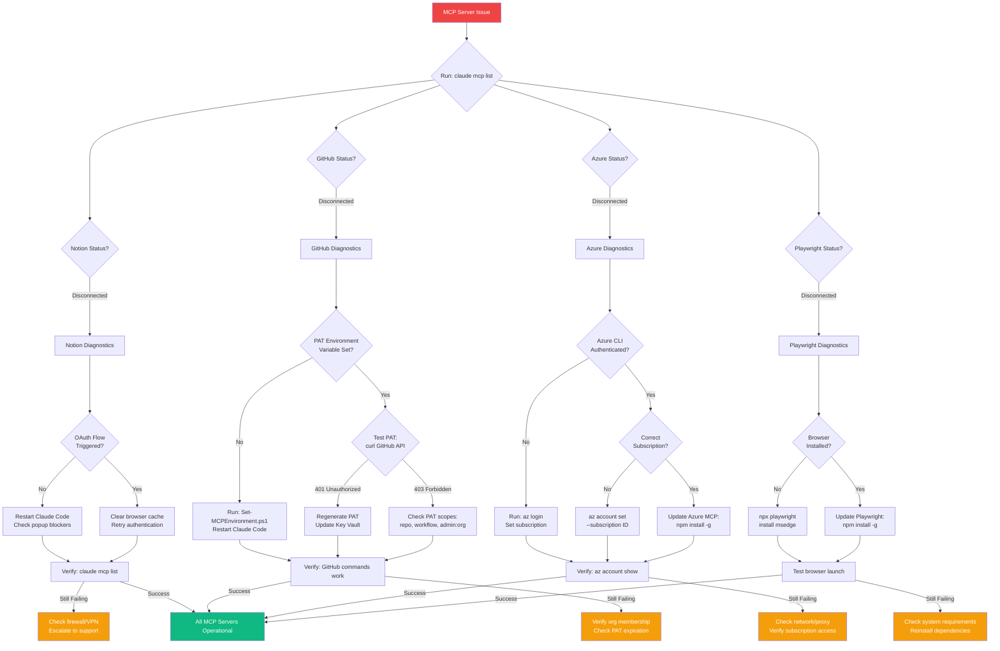
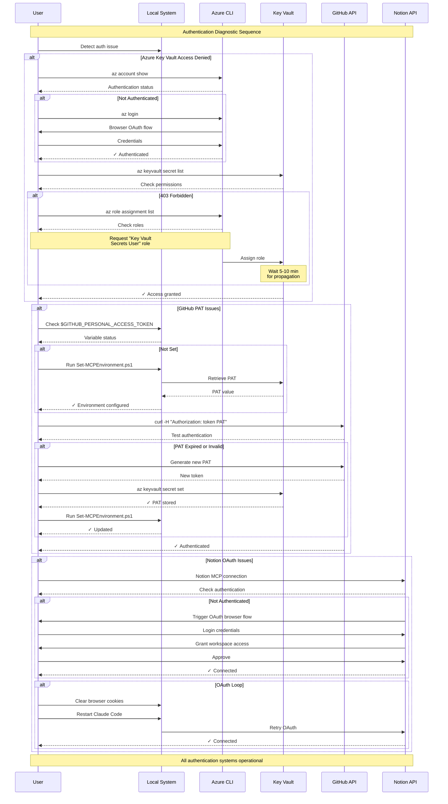

# Troubleshooting Guide - Brookside BI Innovation Nexus

**Objective**: Resolve common issues quickly to maintain productivity

This guide establishes systematic diagnostic procedures for common Innovation Nexus problems to streamline issue resolution and drive operational reliability through structured troubleshooting workflows.

**Best for**: Teams experiencing MCP connection issues, authentication failures, or operational errors requiring rapid resolution.

## Table of Contents

- [MCP Server Issues](#mcp-server-issues)
- [Authentication Problems](#authentication-problems)
- [Notion Database Access](#notion-database-access)
- [GitHub Integration](#github-integration)
- [Azure Operations](#azure-operations)
- [Environment Variables](#environment-variables)
- [Performance Issues](#performance-issues)
- [When to Escalate](#when-to-escalate)

---

## MCP Server Issues

**Visual Diagnostic: Comprehensive MCP Troubleshooting Workflow**



*Figure 1: Comprehensive MCP diagnostic workflow covering all four MCP servers with specific troubleshooting paths and escalation points.*

### Notion MCP Not Connected

**Symptoms**:
- `claude mcp list` shows notion as disconnected
- Notion commands fail with "MCP not available"
- OAuth authentication loop

**Diagnostics**:
```bash
# Check MCP configuration
cat .claude.json | grep -A 5 "notion"

# Verify network connectivity
curl -I https://mcp.notion.com/mcp

# Check Claude Code logs (if available)
```

**Solutions**:

**Solution 1: Restart OAuth Flow**
1. Close Claude Code completely (not just window)
2. Relaunch Claude Code
3. OAuth browser window should open automatically
4. Login and grant workspace access
5. Verify: `claude mcp list` shows ✓ notion: Connected

**Solution 2: Clear Browser Cache**
1. Clear browser cookies for notion.com
2. Clear Claude Code cache (if option exists)
3. Restart Claude Code
4. Retry OAuth flow

**Solution 3: Check Firewall/Proxy**
- Ensure `mcp.notion.com` is not blocked
- Disable VPN temporarily to test
- Check corporate firewall settings
- Verify HTTPS outbound connections allowed

### GitHub MCP Not Responding

**Symptoms**:
- GitHub commands timeout
- "Bad credentials" errors
- Repository not found errors

**Diagnostics**:
```bash
# Check environment variable
echo $GITHUB_PERSONAL_ACCESS_TOKEN

# Test PAT directly
curl -H "Authorization: token $GITHUB_PERSONAL_ACCESS_TOKEN" \
  https://api.github.com/user

# Verify PAT scopes
```

**Solutions**:

**Solution 1: Reconfigure Environment**
```powershell
# Windows PowerShell
.\scripts\Set-MCPEnvironment.ps1

# Restart Claude Code
```

**Solution 2: Verify PAT in Key Vault**
```bash
# Check secret exists
az keyvault secret show --vault-name kv-brookside-secrets \
  --name github-personal-access-token

# If not found, PAT needs to be stored
```

**Solution 3: Regenerate PAT**
1. Go to GitHub Settings → Developer settings → Personal access tokens
2. Generate new token with scopes: `repo`, `workflow`, `admin:org`
3. Store in Key Vault:
   ```bash
   az keyvault secret set --vault-name kv-brookside-secrets \
     --name github-personal-access-token --value "new_token_here"
   ```
4. Run `.\scripts\Set-MCPEnvironment.ps1`
5. Restart Claude Code

### Azure MCP Server Failure

**Symptoms**:
- Azure commands hang or timeout
- "Please run 'az login'" errors
- Subscription not found

**Diagnostics**:
```bash
# Check Azure CLI authentication
az account show

# Test subscription access
az group list --output table

# Verify MCP server can start
npx @azure/mcp@latest server start
```

**Solutions**:

**Solution 1: Re-authenticate**
```bash
az login
az account set --subscription "cfacbbe8-a2a3-445f-a188-68b3b35f0c84"
az account show
```

**Solution 2: Update Azure MCP**
```bash
npm install -g @azure/mcp@latest
# Restart Claude Code
```

**Solution 3: Check Network**
- Ensure Azure endpoints reachable: `ping management.azure.com`
- Disable VPN if causing connectivity issues
- Check corporate proxy settings

### Playwright MCP Issues

**Symptoms**:
- "Browser not installed" errors
- Commands timeout
- Headless mode failures

**Solutions**:

**Solution 1: Install Browser**
```bash
npx @playwright/mcp@latest install
# OR specific browser
npx playwright install msedge
```

**Solution 2: Switch to Headed Mode** (for debugging)
Edit `.claude.json`:
```json
{
  "playwright": {
    "command": "npx",
    "args": ["@playwright/mcp@latest", "--browser", "msedge"]
    // Remove --headless
  }
}
```

**Solution 3: Update Playwright**
```bash
npm install -g @playwright/mcp@latest
```

---

## Authentication Problems

**Visual Flow: Authentication Troubleshooting Process**



*Figure 2: Authentication troubleshooting sequence showing diagnostic steps for Azure Key Vault, GitHub PAT, and Notion OAuth with resolution paths.*

### Azure Key Vault Access Denied

**Symptoms**:
- "403 Forbidden" when retrieving secrets
- "The client does not have authorization" errors

**Diagnostics**:
```bash
# Check Key Vault exists
az keyvault show --name kv-brookside-secrets

# List your permissions
az keyvault secret list --vault-name kv-brookside-secrets

# Check role assignments
az role assignment list --assignee <your-email>
```

**Solutions**:

**Solution 1: Request Permissions**
Contact Azure administrator to assign "Key Vault Secrets User" role:
```bash
az role assignment create \
  --role "Key Vault Secrets User" \
  --assignee <user-principal-id> \
  --scope /subscriptions/cfacbbe8-a2a3-445f-a188-68b3b35f0c84/resourceGroups/rg-brookside-secrets/providers/Microsoft.KeyVault/vaults/kv-brookside-secrets
```

**Solution 2: Enable RBAC** (if using access policies)
```bash
az keyvault update --name kv-brookside-secrets \
  --enable-rbac-authorization true
```

**Solution 3: Wait for Propagation**
- Azure permissions can take 5-10 minutes to propagate
- Try again after waiting period
- Clear Azure CLI cache: `az account clear`

### GitHub PAT Expired

**Symptoms**:
- Sudden authentication failures
- "Token is no longer valid" errors

**Solutions**:
1. Generate new PAT in GitHub settings
2. Update Key Vault:
   ```bash
   az keyvault secret set --vault-name kv-brookside-secrets \
     --name github-personal-access-token --value "new_pat"
   ```
3. Reconfigure environment: `.\scripts\Set-MCPEnvironment.ps1`
4. Restart Claude Code

---

## Notion Database Access

### Database Not Found

**Symptoms**:
- "Could not find database with ID" errors
- Search returns no results

**Solutions**:

**Solution 1: Verify Database ID**
```typescript
// Fetch database to verify ID
{
  "id": "984a4038-3e45-4a98-8df4-fd64dd8a1032"  // Ideas Registry
}
```

**Solution 2: Use Data Source URL**
```typescript
// Search within specific database
{
  "query": "azure",
  "data_source_url": "collection://984a4038-3e45-4a98-8df4-fd64dd8a1032"
}
```

**Solution 3: Check Workspace Access**
- Verify you have access to Brookside BI workspace
- Check database permissions in Notion UI
- Ensure database not deleted or archived

### Property Update Failures

**Symptoms**:
- Update succeeds but properties unchanged
- Invalid property name errors

**Solutions**:

**Solution 1: Fetch Current Schema**
```typescript
// Get exact property names
{
  "id": "database-id-here"
}
// Use exact names from response
```

**Solution 2: Use Correct Property Types**
- Date properties: `date:PropertyName:start`, `date:PropertyName:end`
- Checkbox: `"__YES__"` or `"__NO__"`
- Select/Multi-select: Use exact option names

---

## GitHub Integration

### Repository Not Found

**Symptoms**:
- "404 Not Found" errors
- "Repository does not exist"

**Solutions**:

**Solution 1: Verify Repository Name**
```typescript
// Search for repository
{
  "query": "org:brookside-bi cost-dashboard"
}
```

**Solution 2: Check PAT Permissions**
- Ensure PAT has `repo` scope
- Verify organization membership
- Check repository visibility (public vs private)

### Push Failures

**Symptoms**:
- Push succeeds but changes not visible
- Branch protection errors

**Solutions**:

**Solution 1: Check Branch Protection**
```bash
# View branch protection rules
gh api repos/brookside-bi/repo-name/branches/main/protection
```

**Solution 2: Use Correct Branch**
- Verify branch name: `main` vs `master`
- Check you're not pushing to protected branch
- Create feature branch instead

---

## Azure Operations

### Deployment Failures

**Symptoms**:
- ARM template deployment errors
- Resource provisioning failures
- Quota exceeded errors

**Diagnostics**:
```bash
# Check deployment status
az deployment group list --resource-group rg-name \
  --query "[0].{Name:name, State:properties.provisioningState, Error:properties.error}"

# View detailed logs
az deployment operation group list \
  --resource-group rg-name --name deployment-name
```

**Solutions**:

**Solution 1: Check Quota**
```typescript
{
  "intent": "check quota for virtual machines in eastus",
  "parameters": {
    "subscription": "cfacbbe8-a2a3-445f-a188-68b3b35f0c84",
    "location": "eastus"
  }
}
```

**Solution 2: Deploy to Different Region**
- Try alternate region with available quota
- Check service availability: `az account list-locations`

**Solution 3: Request Quota Increase**
- Azure Portal → Support → New support request
- Select "Service and subscription limits (quotas)"

### Slow Query Performance

**Symptoms**:
- Cost analysis takes > 30 seconds
- Monitoring queries timeout

**Solutions**:
- Reduce timespan: Use `PT1H` instead of `P7D`
- Add specific filters to limit results
- Query during off-peak hours
- Use aggregation instead of raw data

---

## Environment Variables

### Variables Not Persisting

**Symptoms**:
- Environment variables lost after closing terminal
- MCP servers can't find credentials

**Solutions**:

**Solution 1: Use Persistent Configuration**
```powershell
# Windows - Set user-level environment
.\scripts\Set-MCPEnvironment.ps1 -Persistent
```

**Solution 2: Add to Profile** (macOS/Linux)
```bash
# Add to ~/.bashrc or ~/.zshrc
export GITHUB_PERSONAL_ACCESS_TOKEN=$(az keyvault secret show \
  --vault-name kv-brookside-secrets \
  --name github-personal-access-token \
  --query value --output tsv)
```

**Solution 3: Verify Before Launch**
```powershell
# Always run before Claude Code
.\scripts\Set-MCPEnvironment.ps1
claude
```

---

## Performance Issues

### Slow Notion Searches

**Symptoms**:
- Searches take > 10 seconds
- Timeout errors on large workspaces

**Solutions**:
- Use `data_source_url` to restrict scope
- Add date filters to limit results
- Search within specific pages
- Consider caching frequently accessed data

### GitHub Rate Limiting

**Symptoms**:
- "API rate limit exceeded" errors
- 403 responses from GitHub

**Solutions**:
- Wait for rate limit reset (check `X-RateLimit-Reset` header)
- Use authenticated requests (higher limits)
- Implement exponential backoff retry
- Batch operations when possible

---

## When to Escalate

Contact support if you encounter:

- **Persistent MCP failures** after all troubleshooting steps
- **Azure subscription access issues** requiring administrator intervention
- **Key Vault permission errors** that you cannot resolve
- **Data corruption or loss** in Notion databases
- **Security concerns** related to credentials or access
- **Bugs in Claude Code or MCP servers** requiring vendor support

### Contact Information

- **Brookside BI Support**: Consultations@BrooksideBI.com
- **Phone**: +1 209 487 2047
- **GitHub Issues**: [github.com/brookside-bi/notion/issues](https://github.com/brookside-bi/notion/issues)

### Specialist Agents

For specific issues, engage specialized agents:

- **@notion-mcp-specialist** - Notion integration issues
- **@integration-specialist** - Azure/GitHub configuration
- **@cost-analyst** - Cost tracking problems
- **@schema-manager** - Database structure issues

---

## Diagnostic Commands Reference

**Quick Diagnostics**:

```bash
# System Status
claude mcp list
az account show
git status

# MCP Server Tests
.\scripts\Test-AzureMCP.ps1  # Windows
./scripts/test-azure-mcp.sh  # macOS/Linux

# Environment Check
echo $GITHUB_PERSONAL_ACCESS_TOKEN
$env:GITHUB_PERSONAL_ACCESS_TOKEN  # PowerShell

# Key Vault Access
az keyvault secret list --vault-name kv-brookside-secrets

# Network Tests
ping github.com
ping management.azure.com
curl -I https://mcp.notion.com/mcp
```

---

## Related Documentation

- [Quick Start Guide](QUICKSTART.md) - Initial setup procedures
- [API Documentation](docs/api/) - Detailed API references
- [CLAUDE.md](CLAUDE.md) - Complete system documentation
- [Contributing Guide](CONTRIBUTING.md) - Development workflows

---

**Best for**: Teams requiring systematic issue resolution procedures with clear diagnostic steps, proven solutions, and escalation paths that maintain operational continuity.

🤖 Generated with [Claude Code](https://claude.com/claude-code)
