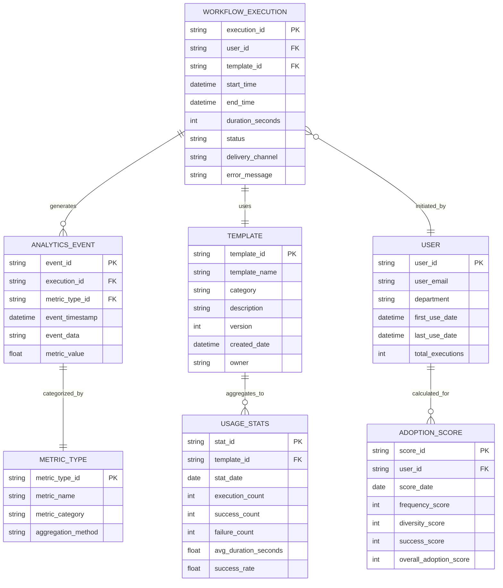

# AI Adoption Accelerator Platform - Architecture Diagrams

**Purpose**: Establish visual documentation for platform architecture that transforms AI adoption through self-service, one-click workflows designed for non-technical end users.

**Business Context**: Eliminate training barriers and complexity to drive measurable AI adoption across organizations. Expected ROI: 20:1 ($260K value vs $12.6K cost).

---

## 1. Platform Architecture Diagram

**Description**: Comprehensive view of Azure services, Power Platform components, M365 integrations, and how they work together to deliver simplified AI experiences.

```mermaid
graph TB
    subgraph "End User Layer"
        User[👤 End Users<br/>Non-Technical Staff]
        Teams[Microsoft Teams<br/>Primary Interface]
        SharePoint[SharePoint<br/>Document Library]
        Outlook[Outlook<br/>Email Integration]
    end

    subgraph "Power Platform Layer - Template Orchestration"
        PATemplates[Power Automate<br/>Template Library<br/>One-Click Workflows]
        PAEngine[Power Automate<br/>Workflow Engine<br/>Orchestration]
        Figma[Figma Templates<br/>UI/UX Design<br/>Guided Experiences]
    end

    subgraph "Azure AI Services Layer"
        AOAI[Azure OpenAI Service<br/>GPT-4 Models<br/>AI Capabilities]
        Functions[Azure Functions<br/>Serverless Compute<br/>Custom Logic]
        KeyVault[Azure Key Vault<br/>kv-brookside-secrets<br/>Secure Credentials]
    end

    subgraph "Integration & Data Layer"
        NotionMCP[Notion MCP<br/>Integration Hub<br/>Template Registry]
        AppInsights[Application Insights<br/>Usage Analytics<br/>Adoption Metrics]
        Storage[Azure Storage<br/>Result Cache<br/>Template Data]
    end

    subgraph "Governance & Security"
        ManagedID[Managed Identity<br/>Zero Secrets<br/>RBAC]
        Monitor[Azure Monitor<br/>Performance Tracking<br/>Health Checks]
    end

    %% End User Connections
    User -->|Select Template| Teams
    User -->|Upload Documents| SharePoint
    User -->|Email Workflows| Outlook

    %% M365 to Power Platform
    Teams -->|One-Click Execute| PATemplates
    SharePoint -->|Document Input| PATemplates
    Outlook -->|Email Triggers| PATemplates

    %% Power Platform Orchestration
    PATemplates -->|Load Guided Workflow| Figma
    PATemplates -->|Execute Workflow| PAEngine
    PAEngine -->|AI Request| AOAI
    PAEngine -->|Custom Processing| Functions

    %% Azure Services Integration
    AOAI -->|Retrieve Secrets| KeyVault
    Functions -->|Store Results| Storage
    Functions -->|Log Analytics| AppInsights

    %% Integration Hub
    PAEngine -->|Track Templates| NotionMCP
    NotionMCP -->|Template Registry| PATemplates
    AppInsights -->|Usage Metrics| NotionMCP

    %% Security & Governance
    ManagedID -.->|Secure Access| AOAI
    ManagedID -.->|Secure Access| Storage
    Monitor -.->|Health Monitoring| PAEngine
    Monitor -.->|Health Monitoring| Functions

    %% Results Flow Back
    PAEngine -->|Deliver Results| Teams
    PAEngine -->|Update Documents| SharePoint
    PAEngine -->|Send Notifications| Outlook

    style User fill:#4472C4,stroke:#2E5090,color:#fff
    style PATemplates fill:#E2725B,stroke:#C85A41,color:#fff
    style AOAI fill:#00A4EF,stroke:#0078D4,color:#fff
    style NotionMCP fill:#000,stroke:#333,color:#fff
    style ManagedID fill:#107C10,stroke:#0B5A0B,color:#fff
```

**Key Features**:
- **Self-Service Access**: End users interact through familiar M365 tools (Teams, SharePoint, Outlook)
- **Template Library**: Power Automate orchestrates pre-built workflows with Figma-designed UI/UX
- **Enterprise AI**: Azure OpenAI Service provides AI capabilities without user complexity
- **Usage Tracking**: Application Insights captures adoption metrics automatically
- **Secure by Design**: Managed Identity and Key Vault eliminate credential management

---

## 2. User Workflow Diagram - One-Click Simplicity

**Description**: End-user journey from template selection to AI workflow execution, emphasizing elimination of training barriers through guided experiences.

**User Experience Highlights**:
- **Step 1**: Browse familiar template catalog (like selecting email template)
- **Step 2**: One-click template selection (no configuration)
- **Step 3**: Minimal input via simple form (upload OR paste)
- **Steps 4-6**: Automated processing (hidden complexity)
- **Step 7**: Results delivered to familiar tools (Teams/SharePoint/Email)

**Adoption Drivers**:
- Zero training required - intuitive as using email
- Familiar M365 interface - no new tools to learn
- Guided forms eliminate decision paralysis
- Instant results build user confidence

---

## 3. Technology Integration Diagram

**Description**: Detailed view of how Notion MCP, Azure services, Power Platform, and M365 ecosystem connect to deliver seamless AI experiences.

**Integration Patterns**:
1. **M365 → Power Platform**: Native connectors enable seamless workflow triggers
2. **Power Platform → Azure**: REST APIs and connectors for AI services and custom logic
3. **Notion MCP → All Layers**: Centralized template registry and usage tracking
4. **Security Layer**: Entra ID for users, Managed Identity for services, RBAC for governance

**Data Synchronization**:
- Template definitions sync from Notion to Power Automate
- Usage metrics flow from Application Insights to Notion databases
- Power BI dashboards visualize adoption trends from Notion data

---

## 4. Data Flow Diagram - Request to Result

**Description**: Complete data flow from user request through AI processing to result delivery, including analytics capture for adoption tracking.

**Data Flow Stages**:

1. **Input & Validation** (0-5 seconds)
   - User provides input via guided form
   - Real-time validation with helpful error messages
   - Queue for processing with priority assignment

2. **Workflow Routing** (1-2 seconds)
   - Identify workflow type (document/text/data)
   - Load appropriate processing pipeline
   - Enrich with context and user preferences

3. **AI Processing** (5-30 seconds)
   - Secure API call via Managed Identity
   - Azure OpenAI GPT-4 processing
   - Automatic retry with exponential backoff (max 3 attempts)

4. **Result Transformation** (2-5 seconds)
   - Format results for target channel
   - Cache in Azure Storage (30-day retention)
   - Prepare delivery metadata

5. **Multi-Channel Delivery** (1-3 seconds)
   - Teams: Direct message with download link
   - SharePoint: Document with metadata tags
   - Email: Attachment with summary

6. **Analytics Capture** (1-2 seconds)
   - Application Insights telemetry
   - Usage metrics (user, template, time, success)
   - Sync to Notion MCP for adoption tracking
   - Power BI dashboard updates

**Performance Targets**:
- **Total Processing Time**: 10-45 seconds (depending on complexity)
- **Success Rate**: >95% (with automatic retry)
- **User Wait Time**: <5 seconds for feedback (progress indicator)

---

## 5. Template Library Architecture

**Description**: Organizational structure for self-service AI workflow templates designed to eliminate training barriers.

```mermaid
graph TD
    subgraph "Template Categories - Use Case Driven"
        DocSum[📄 Document Summarization<br/>• Meeting Notes Summary<br/>• Report Condensation<br/>• Email Thread Summary]

        DataExt[📊 Data Extraction<br/>• Invoice Processing<br/>• Form Data Capture<br/>• Table Extraction]

        Content[✍️ Content Generation<br/>• Email Drafting<br/>• Report Writing<br/>• Social Media Posts]

        Analysis[🔍 Analysis & Insights<br/>• Sentiment Analysis<br/>• Trend Identification<br/>• Risk Assessment]
    end

    subgraph "Template Components"
        UI[Figma UI Design<br/>Guided Forms]
        Logic[Power Automate Logic<br/>Workflow Orchestration]
        Prompts[AI Prompt Engineering<br/>GPT-4 Instructions]
        Rules[Business Rules<br/>Validation & Routing]
    end

    subgraph "Template Registry - Notion MCP"
        Registry[(Template Database<br/>• Name<br/>• Description<br/>• Category<br/>• Version<br/>• Usage Count<br/>• Success Rate)]
    end

    subgraph "Deployment Pipeline"
        Test[Testing Environment<br/>Validation & QA]
        Stage[Staging Environment<br/>User Acceptance]
        Prod[Production Catalog<br/>End User Access]
    end

    %% Template to Components
    DocSum --> UI
    DataExt --> UI
    Content --> UI
    Analysis --> UI

    UI --> Logic
    Logic --> Prompts
    Logic --> Rules

    %% Components to Registry
    UI --> Registry
    Logic --> Registry
    Prompts --> Registry
    Rules --> Registry

    %% Registry to Deployment
    Registry --> Test
    Test -->|Approved| Stage
    Stage -->|Approved| Prod

    %% Feedback Loop
    Prod -.->|Usage Analytics| Registry
    Registry -.->|Template Updates| Test

    style DocSum fill:#4472C4,stroke:#2E5090,color:#fff
    style DataExt fill:#4472C4,stroke:#2E5090,color:#fff
    style Content fill:#4472C4,stroke:#2E5090,color:#fff
    style Analysis fill:#4472C4,stroke:#2E5090,color:#fff
    style Registry fill:#000,stroke:#333,color:#fff
    style Prod fill:#107C10,stroke:#0B5A0B,color:#fff
```

**Template Lifecycle**:
1. **Design**: Figma UI + Power Automate logic + GPT-4 prompts
2. **Register**: Store in Notion MCP with metadata
3. **Test**: Validate in isolated environment
4. **Stage**: User acceptance testing with pilot group
5. **Deploy**: Publish to production catalog
6. **Monitor**: Track usage analytics and success rates
7. **Iterate**: Update based on user feedback and performance data

---

## 6. Adoption Metrics Dashboard - Data Model

**Description**: How usage analytics are captured and visualized to measure platform success and ROI.

**Key Metrics Tracked**:

1. **Execution Metrics**
   - Total workflow executions per day/week/month
   - Success rate (% successful vs failed)
   - Average execution duration
   - Peak usage times

2. **Template Metrics**
   - Most popular templates (by execution count)
   - Template success rates
   - Template performance trends
   - Category distribution

3. **User Adoption Metrics**
   - Unique active users per period
   - New user onboarding rate (first-time users)
   - User retention (repeat usage)
   - Adoption score calculation:
     - **Frequency**: How often user executes workflows
     - **Diversity**: Variety of templates used
     - **Success**: Success rate of executions
     - **Overall**: Weighted composite score (0-100)

4. **ROI Metrics**
   - Time saved per execution (vs manual process)
   - Total time saved across organization
   - Cost per execution (Azure consumption)
   - Value generated (time saved × hourly rate)
   - ROI ratio: Value / Total Platform Cost

**Dashboard Views**:
- Executive Summary: Overall adoption trends, ROI, user growth
- Template Performance: Usage by category, success rates, optimization opportunities
- User Engagement: Active users, adoption scores, department breakdown
- Technical Health: Error rates, performance metrics, infrastructure costs

---

## Usage Notes

**File Location**: `C:\Users\MarkusAhling\Notion\diagrams\ai-adoption-accelerator-architecture.md`

**Rendering**:
- All diagrams use standard Mermaid syntax compatible with GitHub, Notion, and Markdown editors
- Copy individual diagram code blocks to render in your preferred tool
- Diagrams emphasize business outcomes over technical complexity

**Customization**:
- Update Azure service names to match your subscription (e.g., function app names)
- Modify M365 integrations based on your organization's deployment
- Adjust template categories to align with your use cases

**Next Steps**:
1. Review diagrams with Stephan Densby (operations champion)
2. Share with stakeholders to validate architecture decisions
3. Use diagrams in project planning documentation
4. Reference in Technical Design Document (TDD)
5. Update as platform evolves during implementation

**Related Documentation**:
- [Power Automate Template Library Design](link-to-design-doc)
- [Azure OpenAI Integration Guide](link-to-integration-guide)
- [Notion MCP Template Registry Schema](link-to-schema)
- [Adoption Metrics Dashboard Specification](link-to-dashboard-spec)

---

**Brookside BI Innovation Nexus** - Where Complex AI Becomes Simple Workflows, Driving Measurable Adoption Across Organizations.
