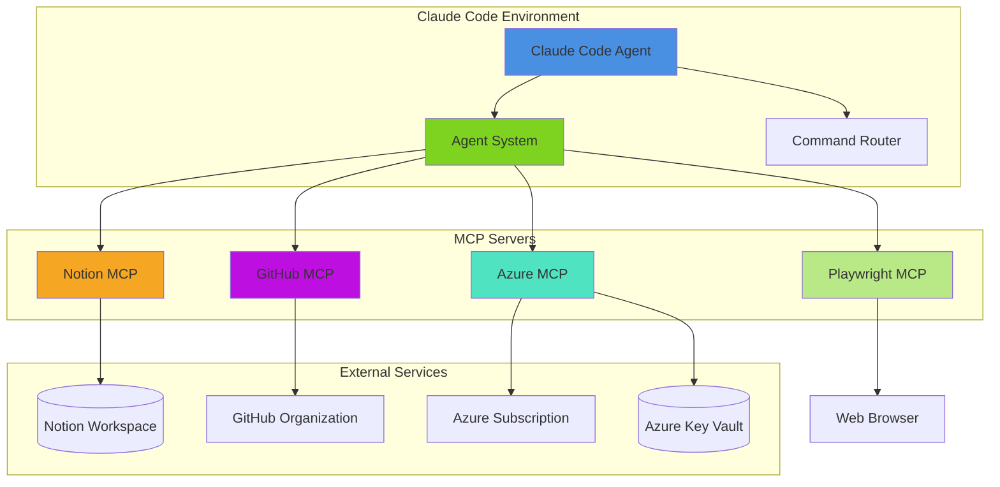
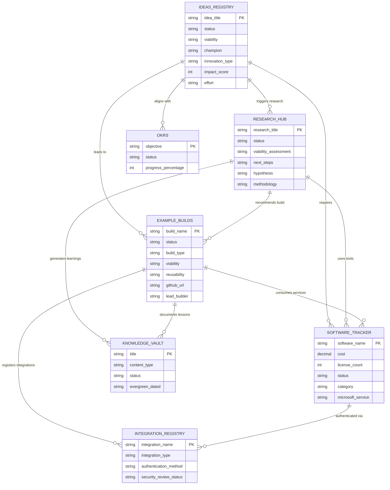
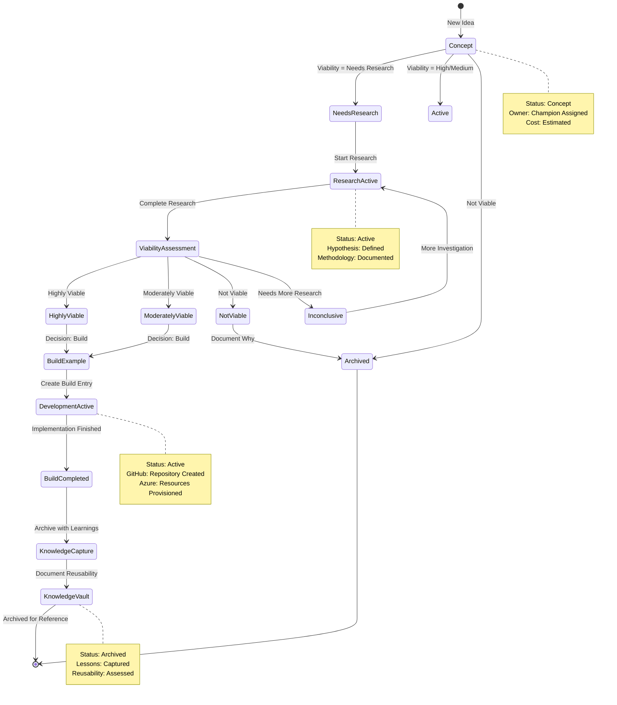
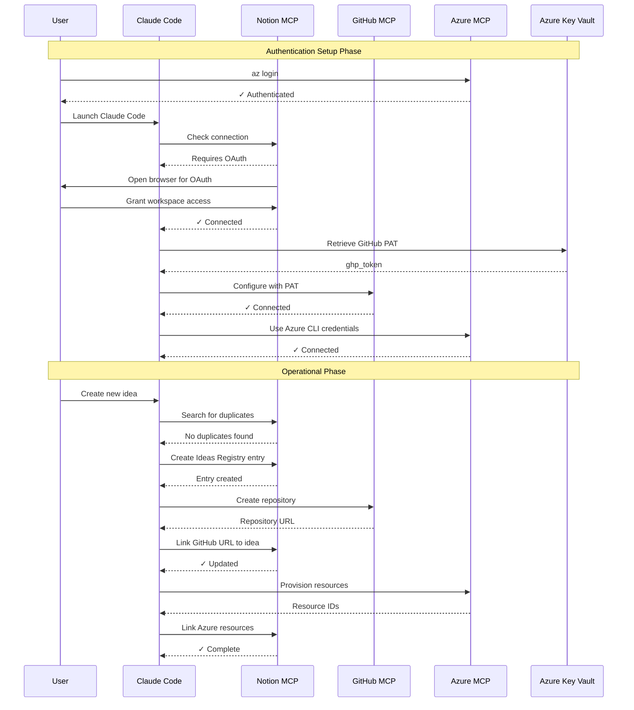
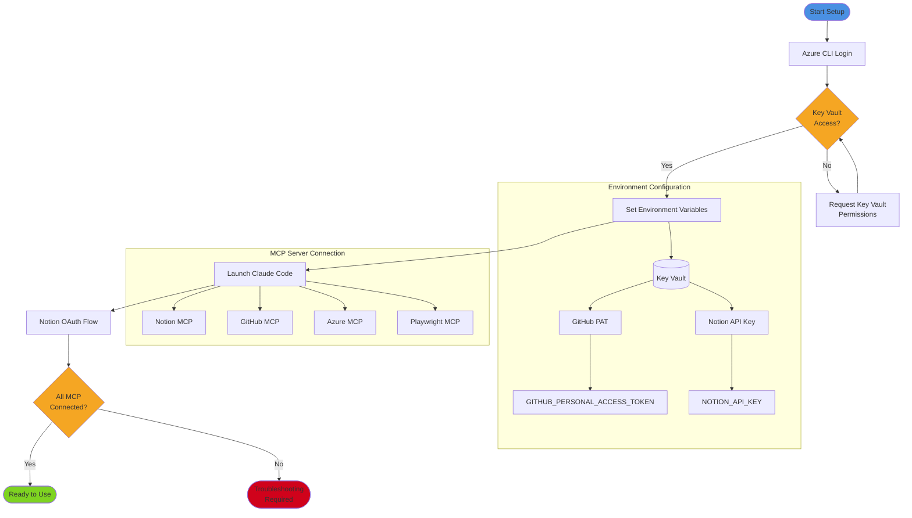
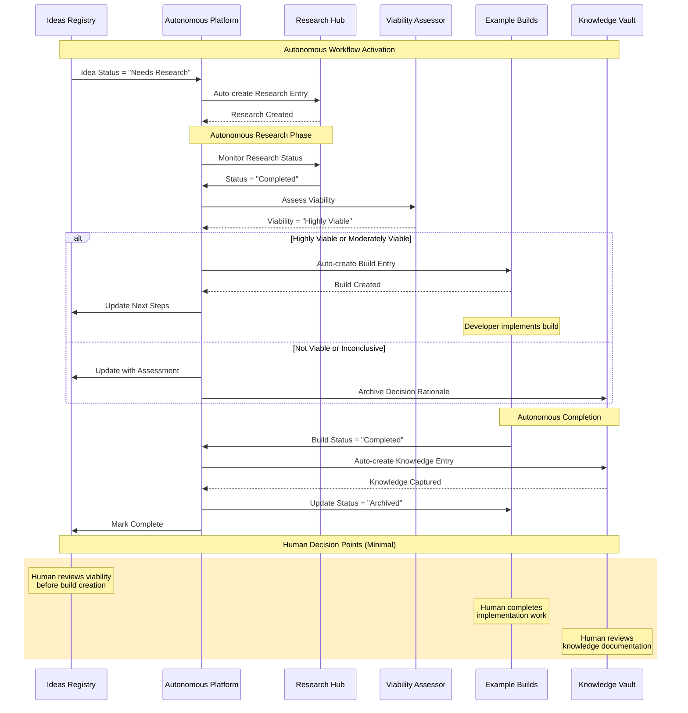

# Architecture Diagrams - Brookside BI Innovation Nexus

**Author**: Claude Code Agent (Mermaid Diagram Expert)
**Date**: October 21, 2025
**Version**: 1.0.0

This document establishes visual system architecture through Mermaid diagrams to streamline understanding of Innovation Nexus structure, workflows, and integrations.

**Best for**: Teams requiring visual documentation of system architecture, database relationships, and operational workflows.

## Table of Contents

- [System Overview](#system-overview)
- [Notion Database Relationships](#notion-database-relationships)
- [Innovation Lifecycle](#innovation-lifecycle)
- [MCP Server Integration](#mcp-server-integration)
- [Agent Coordination](#agent-coordination)
- [Authentication Flow](#authentication-flow)

---

## System Overview

High-level architecture showing major components and integrations:



---

## Notion Database Relationships

Entity relationship diagram showing Innovation Nexus database structure:



---

## Innovation Lifecycle

Complete workflow from idea to knowledge capture:



---

## MCP Server Integration

Authentication and communication flow:



---

## Agent Coordination

Multi-agent workflow for complex operations:

```mermaid
graph TB
    User[User Request]
    Router{Command Router}

    subgraph "Innovation Agents"
        Ideas[@ideas-capture]
        Research[@research-coordinator]
        Build[@build-architect]
        Archive[@archive-manager]
    end

    subgraph "Analysis Agents"
        Cost[@cost-analyst]
        Viability[@viability-assessor]
        Workflow[@workflow-router]
    end

    subgraph "Technical Agents"
        Integration[@integration-specialist]
        Schema[@schema-manager]
        NotionMCP[@notion-mcp-specialist]
        Repo[@repo-analyzer]
    end

    subgraph "Documentation Agents"
        Knowledge[@knowledge-curator]
        Markdown[@markdown-expert]
        Mermaid[@mermaid-diagram-expert]
    end

    User --> Router

    Router -->|/innovation:new-idea| Ideas
    Router -->|/innovation:start-research| Research
    Router -->|Create build| Build
    Router -->|/knowledge:archive| Archive

    Ideas --> Cost
    Ideas --> Workflow
    Ideas --> Viability

    Research --> Cost
    Research --> Integration
    Research --> Viability

    Build --> Integration
    Build --> Cost
    Build --> Repo
    Build --> Workflow

    Archive --> Knowledge
    Knowledge --> Markdown

    Integration --> Schema
    Integration --> NotionMCP

    Build -.->|GitHub ops| Repo
    Build -.->|Azure ops| Integration
    Knowledge -.->|Diagrams| Mermaid

    style User fill:#4A90E2
    style Router fill:#F5A623
    style Ideas fill:#7ED321
    style Cost fill:#BD10E0
    style Integration fill:#50E3C2
```

---

## Authentication Flow

Secure credential management through Azure Key Vault:



---

## Autonomous Pipeline Flow

Self-managing innovation workflow:



---

## Related Documentation

- [CLAUDE.md](../CLAUDE.md) - Complete system documentation
- [API References](api/) - MCP server operations
- [Architectural Patterns](.claude/docs/patterns/) - Enterprise patterns
- [Agent Directory](.claude/agents/) - Specialized agent specifications

---

**Best for**: Teams requiring visual system documentation to understand architecture, workflows, and integration patterns across Innovation Nexus infrastructure.

🤖 Generated with [Claude Code](https://claude.com/claude-code)
