# Template 1: Document Summarizer

**Category**: Document Summarization
**Complexity**: Low
**Estimated Time to Execute**: 15-30 seconds
**Cost per Execution**: $0.05-0.15 (depending on document size)

---

## Use Case Overview

### Business Problem
Employees across the organization spend 3-5 hours per week reading lengthy documents, reports, and proposals. This time-consuming process delays decision-making and reduces productivity, especially for leadership reviewing multiple documents daily.

### Solution Approach
One-click AI-powered document summarization that transforms 10-50 page documents into concise executive summaries, highlighting key findings, decisions needed, and action items. Users simply upload a document and receive a structured summary within 30 seconds.

### Business Value
- **Time Savings**: 80-90% reduction in document review time (30 minutes → 3 minutes)
- **Improved Decision Speed**: Leaders can review 5x more documents in the same time
- **Consistency**: Standardized summary format ensures nothing is missed
- **Accessibility**: Complex documents become accessible to all team members

### Target Users
- Executive leadership reviewing proposals and reports
- Project managers tracking multiple workstreams
- Business analysts synthesizing research
- Any employee needing to quickly understand lengthy documents

---

## User Workflow (One-Click Simplicity)


**Step-by-Step from User Perspective**:
1. Open "Document Summarizer" template from M365 app (Teams, SharePoint, or Outlook)
2. Upload document OR paste text (drag-and-drop supported)
3. Click "Summarize Document" button
4. Wait 15-30 seconds (progress indicator shows AI processing)
5. Review structured summary on screen
6. Choose delivery: Save to SharePoint, Send to Teams, Email to stakeholders, or Download

**User Experience**:
- **Zero technical knowledge required** - as simple as sending an email
- **Familiar Microsoft interface** - integrates into existing M365 workflows
- **Instant feedback** - progress indicators show "AI analyzing document..."
- **Multiple delivery options** - choose how you want to receive results

---

## UI Mockup (Figma-Style Wireframe)

```mermaid
graph TB
    subgraph "Document Summarizer Template Interface"
        A[📄 Document Summarizer]
        B[Upload Document or Paste Text]
        C[Drag and drop file here<br/>or click to browse<br/><br/>Supported: PDF, Word, TXT<br/>Max size: 10MB]
        D[✨ Summarize Document Button]
        E[Delivery Options:<br/>☑ Display on screen<br/>☐ Send to Teams channel<br/>☐ Email to me<br/>☐ Save to SharePoint]

        A --> B
        B --> C
        C --> D
        D --> E
    end

    style A fill:#0078D4,color:#fff
    style D fill:#00B050,color:#fff
```



**Results Display**:
```
┌─────────────────────────────────────────────────────────┐
│ 📊 Executive Summary                                     │
├─────────────────────────────────────────────────────────┤
│ Document: Q3 Financial Performance Report (47 pages)    │
│ Processed: October 22, 2025 at 10:45 AM                 │
│ Processing time: 23 seconds                              │
│                                                          │
│ 🎯 KEY FINDINGS (3-5 bullet points)                     │
│ • Revenue increased 15% YoY to $4.2M                    │
│ • Operating margin improved from 18% to 22%             │
│ • Customer acquisition cost reduced by 30%              │
│                                                          │
│ ⚠️ DECISIONS NEEDED (Extracted action items)            │
│ • Approve $500K investment in sales automation          │
│ • Review pricing strategy for Enterprise tier           │
│                                                          │
│ 📋 NEXT STEPS (What happens next)                       │
│ • Leadership review scheduled for Oct 25                │
│ • Budget allocation decision needed by Oct 30           │
│                                                          │
│ 💬 FULL SUMMARY (2-3 paragraphs)                        │
│ Q3 performance exceeded targets across all key metrics  │
│ driven by successful product launches and improved...   │
│                                                          │
│ [📥 Download Full Summary] [📧 Email Summary]           │
└─────────────────────────────────────────────────────────┘
```

---

## Technical Architecture


### Architecture Components

**Input Processing**:
- Power Automate HTTP trigger (webhook from M365 interface)
- File validation: Check size (<10MB), format (PDF, DOCX, TXT), content safety
- Text extraction: Azure Form Recognizer for PDFs, native Word API for DOCX

**AI Processing**:
- Azure OpenAI Service (GPT-4 Turbo model)
- Token budget: 4,000 output tokens (approximately 3,000 words summary)
- Temperature: 0.3 (consistent, factual summaries)
- Estimated latency: 15-25 seconds for 20-page document

**Output Delivery**:
- Power Automate adaptive cards for Teams
- HTML-formatted email via Outlook connector
- Markdown file saved to SharePoint document library
- Analytics tracking: Usage count, document length, processing time, user satisfaction

---

## Azure OpenAI Prompt Template

```
SYSTEM PROMPT:
You are an expert executive summary writer for Brookside BI. Your role is to transform lengthy business documents into concise, actionable executive summaries that enable fast decision-making.

Guidelines:
- Focus on business outcomes, not technical details
- Highlight key findings, decisions needed, and recommended actions
- Use professional but approachable language (Brookside BI brand voice)
- Structure summaries for scanability (bullet points, clear sections)
- Extract quantifiable metrics and timelines where present
- Flag critical decisions or time-sensitive items

USER PROMPT:
Please analyze the following document and create a structured executive summary.

Document Title: {document_title}
Document Length: {page_count} pages
Document Type: {document_type}

Document Content:
{document_text}

Provide your summary in the following format:

## KEY FINDINGS
- [3-5 bullet points of most important discoveries or insights]

## DECISIONS NEEDED
- [Specific decisions requiring leadership approval or input]
- [Include owner and timeline if mentioned in document]

## NEXT STEPS
- [Recommended actions with priority and timeline]

## FULL SUMMARY
[2-3 paragraph narrative summary connecting key findings, providing context, and explaining business impact]

Focus on clarity and actionability. Assume the reader has 2-3 minutes to understand the document's key points and make decisions.
```

**Prompt Engineering Notes**:
- Dynamic variables: `{document_title}`, `{page_count}`, `{document_type}`, `{document_text}`
- Temperature: 0.3 (balance between creativity and consistency)
- Max tokens: 4,000 output (ensures comprehensive but concise summaries)
- System message establishes Brookside BI brand voice and executive focus

---

## Example Input/Output

### Example Input
**Document**: "Q3 2025 Financial Performance Report"
**Length**: 47 pages
**Format**: PDF
**Content Preview**:
```
BROOKSIDE BI - QUARTERLY FINANCIAL REVIEW
Q3 2025 Performance Analysis

Executive Overview
The third quarter of 2025 demonstrated strong growth across all business units,
with total revenue reaching $4.2M, representing a 15% year-over-year increase...

[45 more pages of detailed financial analysis, charts, departmental breakdowns,
risk assessments, forecasts, and appendices]
```

### Example Output (Generated Summary)
```markdown
📊 Executive Summary: Q3 2025 Financial Performance Report

## KEY FINDINGS
• Revenue increased 15% YoY to $4.2M, exceeding target by 8%
• Operating margin improved from 18% to 22% through cost optimization initiatives
• Customer acquisition cost (CAC) reduced by 30% via marketing automation
• Enterprise segment grew 40% driven by 3 strategic client wins
• Technical debt reduction program delivered $200K in efficiency gains

## DECISIONS NEEDED
• **Sales Automation Investment**: Approve $500K budget for enterprise CRM expansion
  - Owner: Brad Wright (Sales)
  - Timeline: Decision needed by Oct 30 for Q4 implementation
• **Enterprise Pricing Review**: Evaluate 15% price increase for Premium tier
  - Owner: Leadership team
  - Timeline: Oct 25 leadership meeting
• **Hiring Authorization**: Add 2 senior BI consultants to meet demand
  - Owner: Markus Ahling (Operations)
  - Timeline: Approve by Nov 1 for Dec 1 start dates

## NEXT STEPS
1. **Leadership Review** (Oct 25): Present strategic recommendations
2. **Budget Allocation** (Oct 30): Finalize Q4 investment decisions
3. **Client Communication** (Nov 5): Share performance highlights with strategic accounts
4. **Q4 Planning** (Nov 10): Adjust targets based on Q3 momentum

## FULL SUMMARY
Q3 2025 performance exceeded expectations across all key financial and operational
metrics. The 15% revenue growth to $4.2M was driven primarily by enterprise segment
expansion (40% growth) and improved win rates from marketing automation investments.
Operating margin improvement from 18% to 22% reflects successful cost optimization
while maintaining service quality.

The quarter's standout achievement was reducing customer acquisition cost by 30%
through marketing automation, validating our technology investment strategy. Three
strategic enterprise wins position us well for continued growth, though capacity
constraints require immediate hiring decisions.

Looking forward, the leadership team must address three critical decisions: approving
$500K for sales automation expansion, evaluating enterprise pricing strategy, and
authorizing two senior consultant hires. These decisions are time-sensitive to
capitalize on Q3 momentum and meet accelerating customer demand in Q4.
```

**Summary Quality Metrics**:
- Original document: 47 pages (~15,000 words)
- Generated summary: 350 words
- **Compression ratio**: 97.7% reduction in length
- **Reading time**: Original 45 minutes → Summary 2 minutes
- **Time savings**: 43 minutes per document (96% reduction)

---

## Business Rules & Guardrails

### Input Validation
- **Supported formats**: PDF, DOCX, TXT, MD
- **Maximum file size**: 10 MB (approximately 50-75 pages)
- **Minimum file size**: 100 words (prevents "summarizing" trivial content)
- **Content safety**: Azure Content Safety filter (reject documents with PII, confidential markers)
- **Language support**: English (v1), expandable to multilingual in future versions

### Processing Rules
- **Token budget per summary**: 4,000 output tokens maximum
- **Processing timeout**: 60 seconds (retry once if timeout, then error gracefully)
- **Retry logic**: Exponential backoff for transient Azure OpenAI failures
- **Circuit breaker**: Suspend service if >20% failure rate over 5 minutes

### Output Quality
- **Minimum summary length**: 200 words (ensures adequate detail)
- **Maximum summary length**: 500 words (maintains "executive" focus)
- **Required sections**: KEY FINDINGS, DECISIONS NEEDED, NEXT STEPS, FULL SUMMARY
- **Hallucination detection**: Flag if summary mentions facts not in source document

### Usage Limits & Cost Control
- **Per-user daily limit**: 20 summaries (prevents abuse)
- **Organization monthly budget**: $500 token allowance
- **Cost per execution**: $0.05-0.15 depending on document length
- **Alert threshold**: Notify admin if single document costs >$0.50

---

## Power Automate Workflow (Pseudocode)

```
TRIGGER: HTTP Request from M365 Interface
  - Headers: Authorization (Azure AD token), Content-Type
  - Body: { file_url, user_id, delivery_options }

STEP 1: Initialize Variables
  - document_url = triggerBody.file_url
  - user_id = triggerBody.user_id
  - delivery = triggerBody.delivery_options
  - session_id = GUID()

STEP 2: Application Insights - Track Start
  - Log event: "summary_started"
  - Properties: user_id, session_id, timestamp

STEP 3: File Validation
  - Get file metadata from SharePoint/OneDrive
  - IF file_size > 10 MB:
      RETURN error: "File too large (max 10MB)"
  - IF file_type NOT IN [pdf, docx, txt, md]:
      RETURN error: "Unsupported format"
  - Content safety check via Azure Content Safety API
  - IF unsafe_content_detected:
      RETURN error: "Document contains restricted content"

STEP 4: Text Extraction
  - SWITCH file_type:
      CASE "pdf": Azure Form Recognizer OCR
      CASE "docx": Word Online API extract text
      CASE "txt|md": Direct read
  - extracted_text = extraction_result.content
  - page_count = extraction_result.page_count

STEP 5: Prompt Assembly
  - system_prompt = [Load from template]
  - user_prompt = Replace variables:
      {document_title} = file_metadata.name
      {page_count} = page_count
      {document_type} = file_type
      {document_text} = extracted_text

STEP 6: Azure OpenAI API Call
  - Endpoint: https://brookside-openai.openai.azure.com/
  - Model: gpt-4-turbo
  - Parameters:
      messages: [system_prompt, user_prompt]
      temperature: 0.3
      max_tokens: 4000
      top_p: 0.95
  - TRY:
      response = OpenAI.CreateChatCompletion()
      summary = response.choices[0].message.content
  - CATCH timeout:
      RETRY once with exponential backoff
      IF retry fails:
        RETURN error: "Processing timeout - try smaller document"
  - CATCH rate_limit:
      RETURN error: "Service busy - please try again in 1 minute"

STEP 7: Quality Validation
  - IF length(summary) < 200 words:
      RETURN error: "Summary too brief - document may be corrupted"
  - IF length(summary) > 700 words:
      summary = truncate(summary, 500 words) + "... [view full summary]"
  - Check for required sections (KEY FINDINGS, DECISIONS NEEDED, etc.)

STEP 8: Format Results
  - markdown_summary = summary
  - html_email = convert_markdown_to_html(summary)
  - teams_card = create_adaptive_card(summary)
  - metadata = {
      document: file_metadata.name,
      processed: timestamp,
      processing_time: duration_seconds,
      cost: calculate_cost(token_usage)
    }

STEP 9: Deliver Results
  - IF delivery.display_on_screen:
      RETURN response: markdown_summary + metadata
  - IF delivery.send_to_teams:
      Teams.PostMessage(channel, teams_card)
  - IF delivery.email_to_me:
      Outlook.SendEmail(user_id, html_email)
  - IF delivery.save_to_sharepoint:
      SharePoint.CreateFile(summary_library, markdown_summary)

STEP 10: Application Insights - Track Completion
  - Log event: "summary_completed"
  - Properties:
      user_id: user_id
      session_id: session_id
      document_length: page_count
      summary_length: word_count(summary)
      processing_time: duration_seconds
      tokens_used: response.usage.total_tokens
      cost: calculate_cost(token_usage)
      delivery_methods: delivery_options

STEP 11: User Feedback Capture (Optional)
  - Send follow-up Teams message:
      "Rate this summary: 👍 Helpful | 👎 Not Helpful"
  - Store feedback for template optimization

ERROR HANDLING:
  - ALL errors return user-friendly messages
  - ALL errors logged to Application Insights
  - Circuit breaker: Disable template if error rate >20% over 5 minutes
  - Admin notification if cost exceeds $100/day
```

---

## Integration Guide

### Required Power Automate Connectors
1. **HTTP (Premium)** - Trigger from M365 interface
2. **SharePoint** - File access and result storage
3. **Azure OpenAI (Custom)** - AI processing
4. **Microsoft Teams** - Delivery to channels
5. **Office 365 Outlook** - Email delivery
6. **Application Insights (Custom)** - Analytics tracking
7. **Azure Form Recognizer (Custom)** - PDF text extraction
8. **Azure Content Safety (Custom)** - Content filtering

### Azure Resources Required
- **Azure OpenAI Service**:
  - Model: GPT-4 Turbo (gpt-4-1106-preview)
  - Deployment: Standard
  - Quota: 100K tokens/minute minimum
  - Region: East US (primary), West US (failover)

- **Azure Form Recognizer**:
  - Tier: Standard (S0)
  - Feature: Layout API for PDF parsing

- **Azure Content Safety**:
  - Tier: Standard
  - Features: Text moderation, PII detection

- **Application Insights**:
  - Tier: Usage-based pricing
  - Retention: 90 days

### Authentication & Permissions
- **User Authentication**: Azure AD Single Sign-On (inherited from M365)
- **Service Authentication**: Managed Identity for Azure resource access
- **Required Permissions**:
  - User: Read access to SharePoint/OneDrive documents
  - Service Account: Contributor on Azure OpenAI, Form Recognizer, Content Safety
  - Power Automate: Run-only user permissions (no modification rights)

### Security Considerations
- **Data Residency**: All processing occurs in Azure East US region
- **Data Retention**: Source documents NOT stored; summaries stored 90 days
- **PII Handling**: Azure Content Safety filters personally identifiable information
- **Access Control**: Template available to licensed M365 users only
- **Audit Trail**: All usage logged in Application Insights (who, what, when)

### Error Handling Approach
- **Transient Failures**: Automatic retry with exponential backoff (1s, 2s, 4s)
- **Persistent Failures**: User-friendly error message + admin notification
- **Quota Exceeded**: Graceful degradation message: "Service busy - try again in 5 minutes"
- **Invalid Input**: Clear validation messages: "File too large (max 10MB)" not "Error 413"

---

## Cost Analysis

### Per-Execution Cost Breakdown
| Component | Cost per Run | Notes |
|-----------|--------------|-------|
| Azure OpenAI (GPT-4 Turbo) | $0.03-0.12 | Depends on document length (input tokens) |
| Form Recognizer (PDF parsing) | $0.01-0.02 | Per page processed |
| Power Automate (Premium connectors) | $0.003 | Included in user license |
| Application Insights | $0.001 | Log ingestion + query |
| **Total per Execution** | **$0.05-0.15** | Average: $0.08 |

### Monthly Cost Projections
| Scenario | Usage | Monthly Cost | Notes |
|----------|-------|--------------|-------|
| **Light** | 50 summaries/month | $4-8 | Small team testing |
| **Medium** | 200 summaries/month | $16-30 | Typical department usage |
| **Heavy** | 500 summaries/month | $40-75 | Organization-wide rollout |

**Cost Optimization**:
- Reserved capacity for Azure OpenAI (30-40% savings if usage >200/month)
- Batch processing during off-peak hours (no direct cost savings but better quota management)
- Document pre-filtering (skip already-summarized documents via metadata check)

---

## Success Metrics & KPIs

### Usage Metrics (Application Insights)
- **Adoption Rate**: % of target users who use template at least once per week
- **Active Users**: Unique users executing template per month
- **Execution Volume**: Total summaries generated per month
- **Repeat Usage**: % of users who use template 3+ times

### Performance Metrics
- **Average Processing Time**: Target <30 seconds for 90% of documents
- **Success Rate**: Target >95% successful completions
- **Error Rate**: Target <5% failures (transient + persistent)
- **Uptime**: Target >99.5% availability

### Business Value Metrics
- **Time Savings**: Average minutes saved per summary (baseline: 43 minutes)
- **Document Throughput**: Documents reviewed per user per week (before/after)
- **User Satisfaction**: 👍/👎 feedback ratio (target >80% positive)
- **ROI**: Time value savings vs. Azure OpenAI costs (target 20:1)

### Quality Metrics
- **Summary Accuracy**: Manual spot-check (10% random sample) for factual errors
- **Hallucination Rate**: Summaries flagged for facts not in source (target <2%)
- **Coverage Completeness**: % of summaries including all required sections (target 95%)

---

## Continuous Improvement Plan

### Phase 1: MVP (Weeks 1-4)
- Deploy template to pilot group (10-15 early adopters)
- Collect user feedback via Teams messages (👍/👎 + optional comments)
- Monitor Application Insights for performance bottlenecks
- Target: >70% positive feedback, <30 second average processing time

### Phase 2: Optimization (Weeks 5-8)
- Analyze most common document types and optimize prompts
- Add customization options (summary length: brief/standard/detailed)
- Implement document caching (skip re-summarizing unchanged documents)
- Target: 80% positive feedback, 20% increase in repeat usage

### Phase 3: Scale (Weeks 9-12)
- Roll out to full organization
- Add multilingual support (Spanish, French if demand exists)
- Integrate with Microsoft 365 Copilot for seamless experience
- Target: >200 executions/month, maintain >95% success rate

---

## Template Maintenance

### Ownership
- **Product Owner**: Stephan Densby (Operations, Continuous Improvement)
- **Technical Owner**: Alec Fielding (DevOps, Integrations, Security)
- **AI Oversight**: Markus Ahling (AI/ML Engineering)

### Review Schedule
- **Weekly** (Weeks 1-4): Check usage metrics, user feedback, error rates
- **Bi-weekly** (Weeks 5-12): Optimize prompts based on feedback patterns
- **Monthly** (Ongoing): Review costs, success rates, identify new use cases

### Version Control
- **Template Version**: 1.0.0 (MVP release)
- **Prompt Version**: Stored in SharePoint with change log
- **Power Automate Workflow**: GitHub-backed (version-controlled JSON export)
- **Update Process**: Test in dev environment → user acceptance testing → production deployment

---

## Related Templates

**Complementary Templates** (Future Development):
- **Template 2**: Meeting Notes → Action Items Extractor
- **Template 3**: Email Draft Generator
- **Template 4**: Competitive Analysis Report Generator
- **Template 5**: Customer Feedback Sentiment Analyzer

**Template Library Navigation**:
- [← Back to Template Library](./README.md)
- [Next: Meeting Action Items Extractor →](./template-2-meeting-action-extractor.md)

---

**Best for**: Organizations with high document review volume requiring fast, consistent executive summaries to accelerate decision-making. Ideal for leadership teams, project managers, and business analysts who need to process multiple lengthy documents daily while maintaining quality and consistency.

**Status**: ✅ Prototype Ready for User Research
**Last Updated**: October 22, 2025
**Viability**: 💎 High - Core use case with clear ROI and broad applicability
