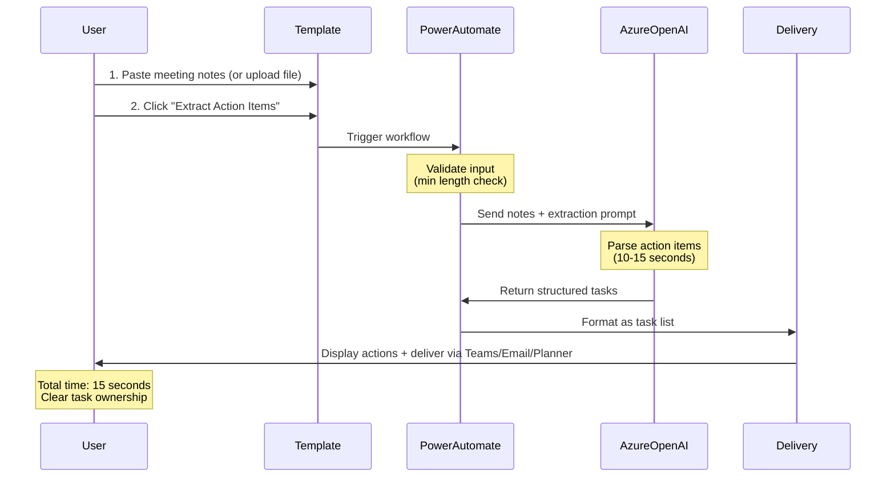
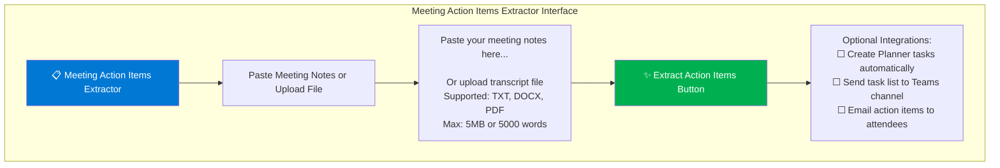
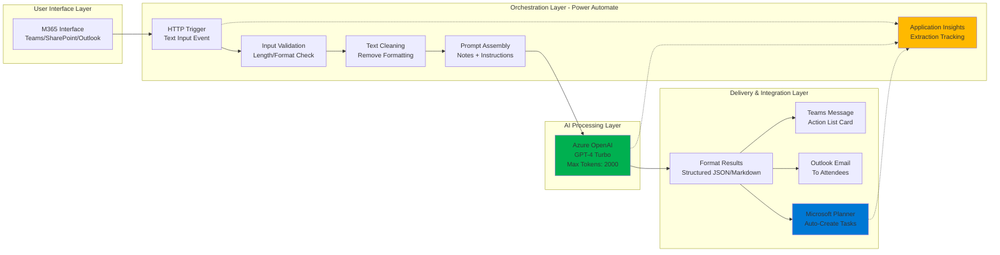

# Template 2: Meeting Notes → Action Items Extractor

**Category**: Data Extraction
**Complexity**: Low
**Estimated Time to Execute**: 10-15 seconds
**Cost per Execution**: $0.02-0.05

---

## Use Case Overview

### Business Problem
After meetings, action items get buried in long meeting notes, scattered across emails, or lost in chat messages. Team members miss critical tasks, accountability is unclear (who owns what), and deadlines slip. Reviewing 3-5 pages of meeting notes to identify action items is time-consuming and error-prone.

### Solution Approach
One-click AI-powered action item extraction that transforms messy meeting notes (any format: typed notes, transcripts, pasted chat logs) into structured, actionable task lists with clear ownership and deadlines. Users paste notes and receive organized action items in 15 seconds.

### Business Value
- **Time Savings**: 90% reduction in post-meeting processing time (20 minutes → 2 minutes)
- **Accountability**: Clear task ownership (every action has a named owner)
- **Follow-Through**: Fewer missed tasks due to structured tracking
- **Integration**: Optionally create Planner/Teams tasks automatically

### Target Users
- Project managers tracking meeting action items
- Team leads managing cross-functional initiatives
- Executive assistants organizing leadership meetings
- Any employee who attends meetings with actionable outcomes

---

## User Workflow (One-Click Simplicity)



**Step-by-Step from User Perspective**:
1. Open "Meeting Action Extractor" template from M365
2. Paste meeting notes OR upload transcript file
3. Click "Extract Action Items"
4. Wait 10-15 seconds (AI processing)
5. Review extracted actions with who/what/when details
6. Choose delivery: Display list, Send to Teams, Email attendees, Create Planner tasks

**User Experience**:
- **Accepts any format** - typed notes, transcripts, chat logs, even bullet points
- **Smart parsing** - finds action items even in unstructured notes
- **Clear ownership** - extracts "who" from context (e.g., "John will follow up")
- **Auto-deadline detection** - identifies dates/timelines mentioned in notes

---

## UI Mockup (Figma-Style Wireframe)



**Results Display**:
```
┌───────────────────────────────────────────────────────────────┐
│ ✅ Action Items Extracted                                      │
├───────────────────────────────────────────────────────────────┤
│ Meeting: Product Roadmap Planning                             │
│ Date: October 22, 2025                                        │
│ Extracted: 8 action items                                     │
│                                                                │
│ 🎯 IMMEDIATE ACTIONS (This Week)                              │
│ 1. ☐ Brad Wright: Schedule pricing review with leadership    │
│    📅 Deadline: Oct 25 (Thu)                                  │
│    📌 Context: Need decision before Q4 planning               │
│                                                                │
│ 2. ☐ Alec Fielding: Provision Azure OpenAI test environment  │
│    📅 Deadline: Oct 24 (Wed)                                  │
│    📌 Context: Blocking prototype development                 │
│                                                                │
│ 📆 UPCOMING ACTIONS (Next 2 Weeks)                            │
│ 3. ☐ Markus Ahling: Draft technical architecture document    │
│    📅 Deadline: Oct 29 (Mon)                                  │
│                                                                │
│ 4. ☐ Stephan Densby: Conduct 10 user interviews              │
│    📅 Deadline: Nov 5                                         │
│    📌 Context: For template validation research               │
│                                                                │
│ ⏰ NO DEADLINE SPECIFIED (Assign deadline)                    │
│ 5. ☐ Brad Wright: Review competitor pricing analysis         │
│    📌 Action: Set deadline in follow-up                       │
│                                                                │
│ ━━━━━━━━━━━━━━━━━━━━━━━━━━━━━━━━━━━━━━━━━━━━━━━━━━━━━━━━━━ │
│                                                                │
│ [📧 Email List] [📋 Copy to Clipboard] [➕ Create Planner Tasks]│
└───────────────────────────────────────────────────────────────┘
```

---

## Technical Architecture



### Architecture Components

**Input Processing**:
- Power Automate HTTP trigger (text input or file upload)
- Input validation: Min 100 words (too short = no meaningful actions)
- Text cleaning: Strip formatting, normalize whitespace, remove artifacts

**AI Processing**:
- Azure OpenAI Service (GPT-4 Turbo model)
- Token budget: 2,000 output tokens (approximately 50-100 action items max)
- Temperature: 0.2 (very consistent extraction)
- Estimated latency: 10-15 seconds for typical meeting notes (2-3 pages)

**Output Delivery**:
- Structured JSON (task array with fields: owner, action, deadline, priority, context)
- Formatted markdown for display/email
- Teams adaptive card with checkboxes
- **Optional**: Microsoft Planner API to auto-create tasks

---

## Azure OpenAI Prompt Template

```
SYSTEM PROMPT:
You are an expert meeting facilitator for Brookside BI. Your role is to extract clear, actionable tasks from meeting notes and assign ownership based on context. You excel at identifying who committed to what, even when notes are informal or unstructured.

Guidelines:
- Extract ONLY explicit action items (things someone committed to DO)
- Do NOT include discussion points, decisions made, or general observations
- Identify task owner from context clues (names, roles, pronouns)
- Extract deadlines from phrases like "by Friday", "end of month", "Q3"
- Flag urgent vs. non-urgent tasks based on language ("ASAP", "critical", "when possible")
- Preserve context for each task (why it matters, what it blocks)
- If owner is unclear, mark as "Owner: To Be Assigned" (do NOT guess)
- If deadline is unclear, mark as "Deadline: TBD" (do NOT invent dates)

USER PROMPT:
Please extract all action items from the following meeting notes.

Meeting Date: {meeting_date}
Attendees: {attendee_list}

Meeting Notes:
{meeting_notes}

For each action item, provide:
1. **Task Owner** (Name of person responsible - mark "TBA" if unclear)
2. **Action Description** (Clear "what" needs to be done)
3. **Deadline** (Specific date or "TBD" if not mentioned)
4. **Priority** (Urgent/High/Medium/Low based on language used)
5. **Context** (Brief why - what does this enable or block)

Format your response as a JSON array:

```json
[
  {
    "owner": "First Last",
    "action": "Clear verb + specific outcome",
    "deadline": "YYYY-MM-DD or TBD",
    "priority": "Urgent|High|Medium|Low",
    "context": "Brief context (1 sentence)"
  }
]
```

Focus on clarity and actionability. Every task must have a clear verb (schedule, draft, review, approve, etc.) and measurable outcome.
```

**Prompt Engineering Notes**:
- Dynamic variables: `{meeting_date}`, `{attendee_list}`, `{meeting_notes}`
- Temperature: 0.2 (very deterministic extraction)
- JSON output format for easy programmatic processing
- Explicit instructions to NOT guess owner or deadline (avoids hallucinations)

---

## Example Input/Output

### Example Input
**Meeting**: Product Roadmap Planning
**Date**: October 22, 2025
**Attendees**: Markus Ahling, Brad Wright, Stephan Densby, Alec Fielding
**Meeting Notes** (3 pages condensed):
```
Product Roadmap Planning - Oct 22, 2025

ATTENDEES: Markus, Brad, Stephan, Alec

DISCUSSION:
- Reviewed Q4 priorities and resource allocation
- Discussed AI adoption platform concept
- Markus presented viability assessment results (88/100 score)

KEY DECISIONS:
1. Proceed with user research phase for AI platform
2. Budget approved: $125/month for discovery phase
3. Stephan will lead user research efforts

ACTION ITEMS:
- Brad needs to schedule pricing review meeting with leadership before
  Oct 25 meeting
- Alec will provision the Azure OpenAI test environment by Wed (Oct 24)
  so we can start prototyping - this is blocking progress
- Markus to draft technical architecture document by end of next week
- Stephan committed to conducting 10 user interviews by Nov 5 for the
  template validation research
- Someone should review the competitor pricing analysis (Brad mentioned
  he'd look into it but no deadline set)
- We discussed migrating from Slack to Teams but no owner assigned yet
- Alec mentioned needing to update security documentation

NOTES:
- Consensus that user research is critical path
- Need quick turnaround on Azure environment (blocking issue)
- Brad emphasized pricing decision impacts Q4 planning timeline

NEXT MEETING: Oct 29, 2025
```

### Example Output (Generated Task List)
```json
[
  {
    "owner": "Brad Wright",
    "action": "Schedule pricing review meeting with leadership",
    "deadline": "2025-10-25",
    "priority": "Urgent",
    "context": "Required before Oct 25 leadership meeting; impacts Q4 planning timeline"
  },
  {
    "owner": "Alec Fielding",
    "action": "Provision Azure OpenAI test environment",
    "deadline": "2025-10-24",
    "priority": "Urgent",
    "context": "Blocking prototype development; needed to start work"
  },
  {
    "owner": "Markus Ahling",
    "action": "Draft technical architecture document",
    "deadline": "2025-10-29",
    "priority": "High",
    "context": "Foundational document for platform design"
  },
  {
    "owner": "Stephan Densby",
    "action": "Conduct 10 user interviews for template validation research",
    "deadline": "2025-11-05",
    "priority": "High",
    "context": "Critical path for validating platform concept before Phase 2"
  },
  {
    "owner": "Brad Wright",
    "action": "Review competitor pricing analysis",
    "deadline": "TBD",
    "priority": "Medium",
    "context": "Informational research for pricing strategy discussion"
  },
  {
    "owner": "TBA",
    "action": "Assign owner for Slack to Teams migration evaluation",
    "deadline": "TBD",
    "priority": "Low",
    "context": "Discussed but no commitment made; needs owner assignment in follow-up"
  },
  {
    "owner": "Alec Fielding",
    "action": "Update security documentation",
    "deadline": "TBD",
    "priority": "Medium",
    "context": "Mentioned as needed, timeline not specified"
  }
]
```

**Extraction Quality Metrics**:
- Original notes: 3 pages (approximately 800 words)
- Extracted actions: 7 tasks
- Owner identification: 6/7 tasks (86% - 1 marked TBA as appropriate)
- Deadline extraction: 4/7 tasks (57% - others correctly marked TBD vs. inventing dates)
- **Processing time**: 12 seconds
- **Time savings**: Post-meeting admin 20 minutes → 2 minutes (90% reduction)

---

## Business Rules & Guardrails

### Input Validation
- **Minimum length**: 100 words (prevents extracting from trivial inputs)
- **Maximum length**: 5,000 words (approximately 10 pages of notes)
- **Supported formats**: Plain text, TXT, DOCX, PDF
- **Required metadata**: Meeting date (defaults to "today" if not provided)

### Extraction Rules
- **Action item criteria**: Must contain commitment language ("will", "commits to", "owns", "responsible for")
- **Do NOT extract**:
  - Discussion points without action
  - Decisions made (unless they require implementation action)
  - FYI/informational notes
  - Questions asked (unless assigned for someone to answer)

### Output Quality
- **Minimum actions**: If <2 actions found, warn "No clear action items detected - check notes"
- **Maximum actions**: If >50 actions found, warn "Unusually high count - verify notes quality"
- **Owner validation**: Cross-check owner names against attendee list when provided
- **Deadline validation**: Ensure deadline > meeting date (catch hallucinated past dates)

### Planner Integration Rules (Optional)
- **Auto-create tasks** only if user explicitly enables checkbox
- **Task bucket**: Create/use "Meeting Action Items" bucket
- **Assignment**: Assign to matched M365 user account (match by name)
- **Due date**: Set Planner due date if deadline extracted
- **Priority**: Map AI priority (Urgent/High/Medium/Low) to Planner priority (Important/Normal)

---

## Power Automate Workflow (Pseudocode)

```
TRIGGER: HTTP Request from M365 Interface
  - Headers: Authorization (Azure AD token)
  - Body: { meeting_notes, meeting_date, attendees[], create_planner_tasks }

STEP 1: Initialize Variables
  - notes = triggerBody.meeting_notes
  - meeting_date = triggerBody.meeting_date || today()
  - attendees = triggerBody.attendees || []
  - create_tasks = triggerBody.create_planner_tasks || false
  - session_id = GUID()

STEP 2: Application Insights - Track Start
  - Log event: "action_extraction_started"
  - Properties: user_id, session_id, notes_length

STEP 3: Input Validation
  - word_count = count_words(notes)
  - IF word_count < 100:
      RETURN error: "Notes too brief (min 100 words) - no meaningful actions to extract"
  - IF word_count > 5000:
      RETURN error: "Notes too long (max 5000 words) - consider splitting into multiple meetings"

STEP 4: Text Cleaning
  - cleaned_notes = strip_html_formatting(notes)
  - cleaned_notes = normalize_whitespace(cleaned_notes)
  - cleaned_notes = remove_special_chars(cleaned_notes)

STEP 5: Prompt Assembly
  - system_prompt = [Load from template]
  - attendee_list = join(attendees, ", ") || "Not specified"
  - user_prompt = Replace variables:
      {meeting_date} = meeting_date
      {attendee_list} = attendee_list
      {meeting_notes} = cleaned_notes

STEP 6: Azure OpenAI API Call
  - Endpoint: https://brookside-openai.openai.azure.com/
  - Model: gpt-4-turbo
  - Parameters:
      messages: [system_prompt, user_prompt]
      temperature: 0.2
      max_tokens: 2000
      response_format: { "type": "json_object" }
  - TRY:
      response = OpenAI.CreateChatCompletion()
      actions_json = parse_json(response.choices[0].message.content)
  - CATCH timeout:
      RETRY once
      IF retry fails:
        RETURN error: "Processing timeout - try shorter notes"
  - CATCH json_parse_error:
      RETURN error: "Failed to extract structured actions - notes may be too unstructured"

STEP 7: Quality Validation
  - action_count = length(actions_json)
  - IF action_count == 0:
      RETURN warning: "No clear action items detected - verify notes contain commitments"
  - IF action_count > 50:
      RETURN warning: "Unusually high action count (50+) - verify notes quality"

  - FOR EACH action IN actions_json:
      # Validate owner against attendee list if provided
      IF attendees.length > 0 AND action.owner != "TBA":
        IF action.owner NOT IN attendees:
          action.owner_warning = "Name not in attendee list - verify spelling"

      # Validate deadline is not in the past
      IF action.deadline != "TBD":
        IF parse_date(action.deadline) < meeting_date:
          action.deadline_warning = "Deadline before meeting date - may be incorrect"

STEP 8: Format Results
  - markdown_list = convert_to_markdown(actions_json)
  - html_email = convert_to_html_table(actions_json)
  - teams_card = create_adaptive_card_with_checkboxes(actions_json)

STEP 9: Deliver Results
  - Display structured action list to user
  - IF user requested Teams delivery:
      Teams.PostMessage(channel, teams_card)
  - IF user requested email:
      Outlook.SendEmail(attendees, html_email)

STEP 10: Optional Planner Integration
  - IF create_tasks == true:
      planner_bucket = Get or Create bucket "Meeting Action Items"

      FOR EACH action IN actions_json:
        task = {
          title: action.action,
          assignee: lookup_user_by_name(action.owner),
          dueDate: action.deadline != "TBD" ? parse_date(action.deadline) : null,
          priority: map_priority(action.priority),
          description: action.context
        }

        TRY:
          Planner.CreateTask(planner_bucket, task)
        CATCH user_not_found:
          # If owner name doesn't match M365 user, create unassigned task
          Planner.CreateTask(planner_bucket, { ...task, assignee: null, note: "Owner TBA: " + action.owner })

STEP 11: Application Insights - Track Completion
  - Log event: "action_extraction_completed"
  - Properties:
      user_id: user_id
      session_id: session_id
      notes_length: word_count
      actions_extracted: action_count
      planner_tasks_created: create_tasks ? action_count : 0
      processing_time: duration_seconds
      tokens_used: response.usage.total_tokens
      cost: calculate_cost(token_usage)

ERROR HANDLING:
  - User-friendly messages for all errors
  - Log all failures to Application Insights
  - Graceful degradation: If Planner creation fails, still deliver action list
```

---

## Integration Guide

### Required Power Automate Connectors
1. **HTTP (Premium)** - Trigger from M365 interface
2. **Azure OpenAI (Custom)** - AI extraction
3. **Microsoft Teams** - Delivery to channels
4. **Office 365 Outlook** - Email delivery
5. **Microsoft Planner (Premium)** - Auto-create tasks
6. **Application Insights (Custom)** - Analytics tracking

### Azure Resources Required
- **Azure OpenAI Service**:
  - Model: GPT-4 Turbo (structured JSON output capability)
  - Deployment: Standard
  - Quota: 50K tokens/minute minimum

- **Application Insights**:
  - Usage tracking and extraction quality metrics

### Authentication & Permissions
- **User Authentication**: Azure AD SSO
- **Planner Integration**: Requires user delegated permission to create tasks
- **Service Account**: Managed Identity for Azure OpenAI access

### Microsoft Planner Setup (Optional)
- **Plan Name**: "Team Action Items" (auto-created if doesn't exist)
- **Bucket**: "Meeting Action Items" (auto-created)
- **Task Assignment**: Requires exact name match with M365 user account
- **Fallback**: If name doesn't match, create unassigned task with note

---

## Cost Analysis

### Per-Execution Cost
| Component | Cost per Run | Notes |
|-----------|--------------|-------|
| Azure OpenAI (GPT-4 Turbo) | $0.01-0.04 | Depends on notes length |
| Power Automate (Premium) | $0.003 | Included in license |
| Planner API (if enabled) | $0.001 | Per task created |
| Application Insights | $0.001 | Log ingestion |
| **Total per Execution** | **$0.02-0.05** | Average: $0.03 |

### Monthly Cost Projections
| Scenario | Usage | Monthly Cost | Notes |
|----------|-------|--------------|-------|
| **Light** | 50 extractions/month | $1-3 | Small team |
| **Medium** | 200 extractions/month | $6-10 | Typical department |
| **Heavy** | 500 extractions/month | $15-25 | Organization-wide |

**Cost Efficiency**: This is the LOWEST cost template ($0.02-0.05 per run) due to short input/output text and simple extraction logic.

---

## Success Metrics & KPIs

### Usage Metrics
- **Adoption Rate**: % of regular meeting attendees using template weekly
- **Extraction Volume**: Total action lists generated per month
- **Planner Integration**: % of extractions that auto-create Planner tasks

### Performance Metrics
- **Average Processing Time**: Target <15 seconds
- **Success Rate**: Target >98% (extraction is simpler than summarization)
- **Error Rate**: Target <2%

### Business Value Metrics
- **Time Savings**: Minutes saved per meeting (baseline: 20 min post-meeting admin)
- **Task Completion Rate**: % of extracted actions marked complete within deadline
- **Missed Action Reduction**: Before/after comparison of overlooked tasks

### Quality Metrics
- **Owner Accuracy**: % of correctly identified task owners (spot-check 10% sample)
- **Deadline Accuracy**: % of correctly extracted deadlines
- **False Positives**: % of "actions" that weren't actually commitments (<5% target)

---

## Continuous Improvement Plan

### Phase 1: MVP (Weeks 1-4)
- Deploy to pilot group
- Focus on manual task list delivery (skip Planner integration initially)
- Collect feedback: Are extracted actions accurate? Any missed items?
- Target: >90% owner accuracy, >85% deadline accuracy

### Phase 2: Integration (Weeks 5-8)
- Enable Planner auto-creation for users who request it
- Add attendee lookup to improve owner matching
- Implement "Review & Edit" step before creating Planner tasks
- Target: >70% of users enable Planner integration

### Phase 3: Intelligence (Weeks 9-12)
- Learn from user edits (track which actions get modified)
- Add meeting type detection (standup vs. planning vs. retrospective)
- Customize extraction style based on meeting type
- Target: <5% post-extraction edits needed

---

## Template Maintenance

### Ownership
- **Product Owner**: Stephan Densby
- **Technical Owner**: Alec Fielding
- **AI Oversight**: Markus Ahling

### Review Schedule
- **Weekly** (Weeks 1-4): Check extraction accuracy, false positive rate
- **Bi-weekly** (Weeks 5-12): Optimize prompt based on common miss patterns
- **Monthly** (Ongoing): Review Planner integration usage, cost efficiency

### Version Control
- **Template Version**: 1.0.0
- **Prompt Version**: Stored in SharePoint with change log
- **Power Automate Workflow**: GitHub-backed JSON export

---

## Related Templates

**Complementary Templates**:
- **Template 1**: Document Summarizer (pre-meeting briefing documents)
- **Template 3**: Email Draft Generator (send action summaries to stakeholders)
- **Future**: Meeting Agenda Generator (create agendas from previous action items)

**Template Library Navigation**:
- [← Previous: Document Summarizer](./template-1-document-summarizer.md)
- [Back to Template Library](./README.md)
- [Next: Email Draft Generator →](./template-3-email-draft-generator.md)

---

**Best for**: Organizations with frequent meetings requiring clear accountability and task tracking. Ideal for project managers, team leads, and departments struggling with post-meeting follow-through and missed action items.

**Status**: ✅ Prototype Ready for User Research
**Last Updated**: October 22, 2025
**Viability**: 💎 High - Practical use case with immediate time savings and clear ROI