# Template 3: Email Draft Generator

**Category**: Content Generation
**Complexity**: Low
**Estimated Time to Execute**: 5-10 seconds
**Cost per Execution**: $0.01-0.03

---

## Use Case Overview

### Business Problem
Writing professional emails is time-consuming, especially when communicating with clients, stakeholders, or leadership. Employees spend 10-15 minutes crafting each important email, worrying about tone, clarity, and completeness. This creates a bottleneck for high-volume communications (client follow-ups, project updates, team announcements).

### Solution Approach
One-click AI-powered email draft generation that transforms bullet points or brief context into polished, professional emails matching Brookside BI's brand voice. Users provide purpose, audience, and key points; receive a ready-to-send draft in 10 seconds.

### Business Value
- **Time Savings**: 80-85% reduction in email writing time (15 minutes → 2-3 minutes)
- **Consistency**: All emails match Brookside BI professional brand voice
- **Confidence**: Clear, well-structured messages reduce miscommunication
- **Scalability**: Handle high-volume communications efficiently

### Target Users
- Sales team (client follow-ups, proposals, meeting recaps)
- Project managers (status updates, stakeholder communications)
- Leadership (team announcements, strategic communications)
- Any employee sending important external or internal emails

---

## User Workflow (One-Click Simplicity)


**Step-by-Step from User Perspective**:
1. Open "Email Draft Generator" template from M365
2. Fill simple form:
   - **Purpose**: Why am I sending this email? (e.g., "Follow up on yesterday's meeting")
   - **Audience**: Who is receiving it? (e.g., "Client stakeholder - CEO level")
   - **Key Points**: What must be included? (3-5 bullet points)
3. Choose options:
   - **Tone**: Professional | Friendly | Formal | Urgent
   - **Length**: Brief (3-4 sentences) | Standard (2 paragraphs) | Detailed (3-4 paragraphs)
   - **Call to Action**: Meeting request | Decision needed | Informational only | Next steps
4. Click "Generate Email Draft"
5. Review draft (edits allowed - it's a starting point)
6. Click "Open in Outlook" to send

**User Experience**:
- **Guided inputs** - clear form questions (no AI expertise required)
- **Customizable** - tone, length, formality options
- **Brand-consistent** - automatic Brookside BI voice
- **Direct to Outlook** - one click to open draft for final review/send

---

## UI Mockup (Figma-Style Wireframe)

```mermaid
graph TB
    subgraph "Email Draft Generator Interface"
        A[✉️ Email Draft Generator]
        B[Email Context Form]
        C[Purpose: Why are you sending this email?<br/>Audience: Who is receiving it?<br/>Key Points: Bullet list of main points to include]
        D[Options]
        E[Tone: Professional ▼<br/>Length: Standard ▼<br/>Call to Action: Meeting request ▼]
        F[✨ Generate Email Draft Button]

        A --> B
        B --> C
        C --> D
        D --> E
        E --> F
    end

    style A fill:#0078D4,color:#fff
    style F fill:#00B050,color:#fff
```



**Results Display**:
```
┌─────────────────────────────────────────────────────────────┐
│ ✉️ Generated Email Draft                                    │
├─────────────────────────────────────────────────────────────┤
│ To: [Recipient name/email]                                  │
│ Subject: Follow-Up: AI Adoption Platform Discussion        │
│                                                              │
│ Dear Sarah,                                                  │
│                                                              │
│ Thank you for the productive conversation yesterday         │
│ regarding the AI Adoption Accelerator Platform. I wanted to │
│ follow up on the key points we discussed and outline next   │
│ steps to keep momentum moving forward.                      │
│                                                              │
│ **Key Takeaways from Our Discussion:**                      │
│ • User research phase scheduled to begin October 25         │
│ • Budget approval granted for discovery phase ($125/month)  │
│ • Timeline: 2-4 weeks for validation, decision by mid-Nov   │
│                                                              │
│ **Proposed Next Steps:**                                    │
│ 1. Schedule stakeholder alignment meeting (week of Oct 28)  │
│ 2. Share user research findings as they emerge              │
│ 3. Present GO/NO-GO recommendation by November 15           │
│                                                              │
│ Would you be available for a 30-minute check-in next Tuesday│
│ (October 29) at 2:00 PM to review progress? I'll send a     │
│ calendar invite if that works for your schedule.            │
│                                                              │
│ Please let me know if you have any questions or would like  │
│ to discuss any of these points further.                     │
│                                                              │
│ Best regards,                                                │
│ Markus Ahling                                                │
│ AI/ML Engineering Lead                                       │
│ Brookside BI                                                 │
│ Consultations@BrooksideBI.com | +1 209 487 2047            │
│                                                              │
│ [📝 Edit Draft] [📧 Open in Outlook] [📋 Copy to Clipboard] │
└─────────────────────────────────────────────────────────────┘
```

---

## Technical Architecture


### Architecture Components

**Input Processing**:
- Simple form with 3 required fields (purpose, audience, key points)
- 3 optional customization fields (tone, length, call-to-action)
- Validation: Purpose and audience required; key points min 1 bullet

**AI Processing**:
- Azure OpenAI Service (GPT-4 Turbo model)
- Token budget: 1,000 output tokens (approximately 400-600 words - perfect for emails)
- Temperature: 0.7 (balance between creativity and professionalism)
- Estimated latency: 5-10 seconds

**Output Delivery**:
- Formatted email text with subject line, salutation, body, signature
- **Outlook integration**: Auto-populate new draft email (user reviews before sending)
- Fallback: Copy to clipboard if Outlook integration fails

---

## Azure OpenAI Prompt Template

```
SYSTEM PROMPT:
You are a professional communication specialist for Brookside BI. Your role is to craft clear, concise, and professional emails that reflect Brookside BI's brand voice: professional but approachable, solution-focused, and consultative.

**Brookside BI Brand Voice Guidelines**:
- Professional yet accessible (avoid overly formal or stiff language)
- Solution-focused (frame around outcomes and value)
- Consultative (position as partnership, not just service delivery)
- Action-oriented (clear next steps and calls to action)
- Transparent (specific timelines, costs, expectations)

**Email Best Practices**:
- Lead with context/purpose (why you're writing)
- Use clear structure (paragraphs, bullets where appropriate)
- Include specific next steps or call to action
- Close with professional courtesy
- Match tone to audience (more formal for executives, friendly for colleagues)

USER PROMPT:
Please draft a professional email based on the following context.

**Email Purpose**: {email_purpose}
**Recipient Audience**: {recipient_audience}
**Key Points to Include**:
{key_points_list}

**Style Preferences**:
- Tone: {tone} (Professional | Friendly | Formal | Urgent)
- Length: {length} (Brief | Standard | Detailed)
- Call to Action: {cta_type} (Meeting request | Decision needed | Informational | Next steps)

**Output Format**:
Subject: [Concise, action-oriented subject line]

[Appropriate salutation based on audience]

[Email body with clear structure, incorporating all key points]

[Call to action matching requested type]

[Professional closing]

[Signature block - use sender's name and title if provided, otherwise use "Brookside BI Team"]

Focus on clarity, professionalism, and actionability. Ensure the email feels personal and specific (not generic/templated).
```

**Prompt Engineering Notes**:
- Dynamic variables: `{email_purpose}`, `{recipient_audience}`, `{key_points_list}`, `{tone}`, `{length}`, `{cta_type}`
- Temperature: 0.7 (creative enough for natural language, consistent enough for professionalism)
- Brookside BI brand voice embedded in system prompt
- Explicit instruction to avoid generic/templated feel

---

## Example Input/Output

### Example Input (Form Fields)
**Purpose**: Follow up on yesterday's AI platform discussion
**Audience**: Client stakeholder - CEO level
**Key Points**:
- User research phase starts Oct 25
- Budget approved for discovery ($125/month)
- Timeline: 2-4 weeks validation, decision by mid-Nov
- Want to schedule check-in meeting next week

**Tone**: Professional
**Length**: Standard (2 paragraphs)
**Call to Action**: Meeting request

### Example Output (Generated Draft)
```
Subject: Follow-Up: AI Adoption Platform Discussion

Dear Sarah,

Thank you for the productive conversation yesterday regarding the AI Adoption Accelerator Platform. I wanted to follow up on the key points we discussed and outline next steps to keep momentum moving forward.

**Key Takeaways from Our Discussion:**
• User research phase scheduled to begin October 25
• Budget approval granted for discovery phase ($125/month)
• Timeline: 2-4 weeks for validation, decision by mid-November

**Proposed Next Steps:**
1. Schedule stakeholder alignment meeting (week of Oct 28)
2. Share user research findings as they emerge
3. Present GO/NO-GO recommendation by November 15

Would you be available for a 30-minute check-in next Tuesday (October 29) at 2:00 PM to review progress? I'll send a calendar invite if that works for your schedule.

Please let me know if you have any questions or would like to discuss any of these points further.

Best regards,
Markus Ahling
AI/ML Engineering Lead
Brookside BI
Consultations@BrooksideBI.com | +1 209 487 2047
```

**Generation Quality Metrics**:
- **Processing time**: 8 seconds
- **Word count**: 140 words (perfect for standard email length)
- **Tone**: Professional, clear, action-oriented
- **Brand voice**: ✓ Brookside BI guidelines followed
- **Time savings**: 15 min manual writing → 2 min review/send (87% reduction)

---

## Example Scenarios (Use Cases)

### Scenario 1: Client Follow-Up (Sales)
**Purpose**: Thank client for meeting and provide pricing proposal
**Audience**: VP of Operations at mid-sized company
**Key Points**:
- Appreciated discussion about BI modernization needs
- Attached pricing proposal for 3-month engagement
- Highlighted 3 key benefits from conversation
- Requesting decision by end of month

**Generated Email** (Brief, Professional):
```
Subject: Brookside BI Engagement Proposal - Following Up

Hi Jennifer,

Thank you for the excellent discussion yesterday about your BI modernization initiative. Based on our conversation, I've attached a tailored proposal outlining a 3-month engagement focused on Power BI migration, data governance framework, and team enablement.

**Key Benefits Highlighted**:
• 40% reduction in report generation time
• Centralized governance reducing compliance risk
• Self-service analytics empowering your team

I'm available to discuss the proposal this week if you have any questions. To meet your Q4 timeline, we'd ideally receive approval by October 31.

Best regards,
Brad Wright
Sales & Business Development
Brookside BI
```

### Scenario 2: Project Status Update (Internal)
**Purpose**: Weekly status update to leadership
**Audience**: Internal leadership team
**Key Points**:
- User research phase on track (10/15 interviews complete)
- Early feedback positive (85% satisfaction)
- On budget ($115 of $125 spent)
- Next milestone: Viability report by Nov 1

**Generated Email** (Friendly, Brief):
```
Subject: AI Platform - Week 2 Status Update

Team,

Quick update on the AI Adoption Accelerator Platform user research phase:

**Progress This Week**:
✓ Completed 10 of 15 user interviews
✓ Early feedback trending positive (85% satisfaction)
✓ Budget on track ($115 of $125 monthly allocation spent)

**Next Milestone**: Viability report with GO/NO-GO recommendation ready by November 1.

Happy to discuss details at tomorrow's leadership sync if needed.

- Stephan
```

### Scenario 3: Meeting Request (External)
**Purpose**: Request introductory meeting with prospective client
**Audience**: CTO at enterprise company
**Key Points**:
- Referred by mutual connection (John Smith)
- Specialize in Azure + Power BI for manufacturing sector
- Would love 30-minute intro call
- Flexible on timing

**Generated Email** (Professional, Formal):
```
Subject: Introduction Request - Azure BI Solutions for Manufacturing

Dear Dr. Martinez,

John Smith suggested I reach out regarding Brookside BI's work in Azure cloud and Power BI solutions tailored for the manufacturing sector. We've helped organizations similar to yours establish scalable BI platforms that drive measurable operational improvements.

I'd welcome the opportunity for a brief 30-minute introductory conversation to learn about your current BI initiatives and explore whether our expertise might be valuable. I'm flexible on timing and happy to work around your schedule.

Would sometime in the next two weeks work for you? I can send a calendar invite with a few time options if you're interested.

Thank you for considering this request.

Respectfully,
Markus Ahling
AI/ML Engineering Lead
Brookside BI
Consultations@BrooksideBI.com | +1 209 487 2047
```

---

## Business Rules & Guardrails

### Input Validation
- **Required fields**:
  - Purpose: Min 10 characters (too vague otherwise)
  - Audience: Min 5 characters (need context for tone)
  - Key Points: At least 1 bullet point
- **Optional fields**: Tone, Length, Call to Action (defaults applied if not specified)

### Generation Rules
- **Maximum output**: 600 words (prevents overly long emails)
- **Minimum output**: 80 words (ensures substantive content)
- **Subject line**: Auto-generated, max 60 characters (email client compatibility)
- **Brand voice**: Brookside BI guidelines enforced in system prompt

### Output Quality
- **Tone validation**: Verify generated email matches requested tone
- **Completeness check**: Ensure all key points appear in body
- **Call to action**: Verify CTA type is present and clear
- **Signature**: Auto-append Brookside BI contact info

### Content Safety
- **PII filtering**: Remove any accidentally included sensitive data
- **Professionalism check**: Flag if AI generates inappropriate language (rare but possible)
- **Fact-checking**: Warn if AI invents specific facts not in key points

---

## Power Automate Workflow (Pseudocode)

```
TRIGGER: HTTP Request from M365 Interface
  - Headers: Authorization (Azure AD token)
  - Body: { purpose, audience, key_points[], tone, length, cta_type, sender_name, sender_title }

STEP 1: Initialize Variables
  - purpose = triggerBody.purpose
  - audience = triggerBody.audience
  - key_points = triggerBody.key_points
  - tone = triggerBody.tone || "Professional"
  - length = triggerBody.length || "Standard"
  - cta_type = triggerBody.cta_type || "Next steps"
  - sender_name = triggerBody.sender_name || user.displayName
  - sender_title = triggerBody.sender_title || user.jobTitle

STEP 2: Application Insights - Track Start
  - Log event: "email_generation_started"
  - Properties: user_id, tone, length, cta_type

STEP 3: Input Validation
  - IF length(purpose) < 10:
      RETURN error: "Purpose too brief - please describe why you're sending this email"
  - IF length(audience) < 5:
      RETURN error: "Please specify recipient audience for appropriate tone"
  - IF key_points.length == 0:
      RETURN error: "Please provide at least one key point to include"

STEP 4: Prompt Assembly
  - system_prompt = [Load Brookside BI brand voice template]
  - key_points_formatted = format_as_bullets(key_points)
  - user_prompt = Replace variables:
      {email_purpose} = purpose
      {recipient_audience} = audience
      {key_points_list} = key_points_formatted
      {tone} = tone
      {length} = length
      {cta_type} = cta_type

STEP 5: Azure OpenAI API Call
  - Endpoint: https://brookside-openai.openai.azure.com/
  - Model: gpt-4-turbo
  - Parameters:
      messages: [system_prompt, user_prompt]
      temperature: 0.7
      max_tokens: 1000
  - TRY:
      response = OpenAI.CreateChatCompletion()
      email_draft = response.choices[0].message.content
  - CATCH timeout:
      RETRY once
      IF retry fails:
        RETURN error: "Generation timeout - please try again"

STEP 6: Post-Processing
  - Parse email_draft into components:
      subject_line = extract_subject(email_draft)
      email_body = extract_body(email_draft)

  - Append signature if not already present:
      IF email_body NOT contains "Brookside BI":
        email_body += "\n\n" + generate_signature(sender_name, sender_title)

  - Validate length:
      word_count = count_words(email_body)
      IF word_count > 600:
        email_body = truncate_to_words(email_body, 550) + "\n\n[Continued in follow-up if needed]"

STEP 7: Format for Outlook
  - outlook_draft = {
      subject: subject_line,
      body: convert_markdown_to_html(email_body),
      importance: tone == "Urgent" ? "High" : "Normal"
    }

STEP 8: Deliver Results
  - Display email draft to user (HTML preview)
  - Provide options:
      [Open in Outlook] - Create new draft email in Outlook
      [Copy to Clipboard] - Fallback if Outlook unavailable
      [Edit & Regenerate] - Modify inputs and try again

STEP 9: Outlook Integration (if selected)
  - TRY:
      Outlook.CreateDraftEmail(outlook_draft)
      # This opens Outlook with draft populated - user reviews and sends
  - CATCH outlook_unavailable:
      FALLBACK: Copy email to clipboard
      NOTIFY user: "Outlook unavailable - email copied to clipboard"

STEP 10: Application Insights - Track Completion
  - Log event: "email_generation_completed"
  - Properties:
      user_id: user_id
      tone: tone
      length: length
      cta_type: cta_type
      word_count: word_count
      processing_time: duration_seconds
      tokens_used: response.usage.total_tokens
      cost: calculate_cost(token_usage)
      opened_in_outlook: boolean

ERROR HANDLING:
  - User-friendly messages
  - Log all failures to Application Insights
  - Fallback to clipboard if Outlook integration fails
```

---

## Integration Guide

### Required Power Automate Connectors
1. **HTTP (Premium)** - Trigger from M365 interface
2. **Azure OpenAI (Custom)** - Email generation
3. **Office 365 Outlook** - Create draft emails
4. **Application Insights (Custom)** - Analytics tracking

### Azure Resources Required
- **Azure OpenAI Service**:
  - Model: GPT-4 Turbo
  - Deployment: Standard
  - Quota: 50K tokens/minute minimum

- **Application Insights**:
  - Track generation volume, tone distribution, user feedback

### Authentication & Permissions
- **User Authentication**: Azure AD SSO
- **Outlook Integration**: Requires user delegated permission to create drafts
- **Service Account**: Managed Identity for Azure OpenAI

---

## Cost Analysis

### Per-Execution Cost
| Component | Cost per Run | Notes |
|-----------|--------------|-------|
| Azure OpenAI (GPT-4 Turbo) | $0.005-0.02 | Brief emails cost less |
| Power Automate (Premium) | $0.003 | Included in license |
| Application Insights | $0.001 | Log ingestion |
| **Total per Execution** | **$0.01-0.03** | Average: $0.015 |

**Cost Efficiency**: This is the LOWEST cost template ($0.01-0.03 per run) alongside the meeting action extractor, due to short output length.

### Monthly Cost Projections
| Scenario | Usage | Monthly Cost | Notes |
|----------|-------|--------------|-------|
| **Light** | 50 emails/month | $0.50-1.50 | Individual user |
| **Medium** | 200 emails/month | $3-6 | Small team |
| **Heavy** | 500 emails/month | $7.50-15 | Department-wide |

**ROI**: Even at heavy usage ($15/month), the time savings (500 emails × 10 min saved = 83 hours = $4,150 value at $50/hr) delivers 275:1 ROI.

---

## Success Metrics & KPIs

### Usage Metrics
- **Adoption Rate**: % of employees generating at least 1 email/week
- **Generation Volume**: Total drafts created per month
- **Scenario Distribution**: % breakdown by tone (Professional/Friendly/Formal/Urgent)

### Performance Metrics
- **Average Processing Time**: Target <10 seconds
- **Success Rate**: Target >99% (simple generation task)
- **Outlook Integration Rate**: % of drafts opened in Outlook vs. copied

### Business Value Metrics
- **Time Savings**: Minutes saved per email (baseline: 15 min manual → 2 min review)
- **Email Quality**: User feedback on draft quality (👍/👎)
- **Revision Rate**: % of drafts sent without edits (indicates quality)

### Quality Metrics
- **Brand Voice Compliance**: Spot-check sample for Brookside BI voice adherence
- **Completeness**: % of drafts including all requested key points
- **Tone Match**: % of drafts matching requested tone (Professional/Friendly/etc.)

---

## Continuous Improvement Plan

### Phase 1: MVP (Weeks 1-4)
- Deploy to sales team and project managers first (high email volume)
- Collect feedback: Are drafts usable? What gets edited most?
- Target: >80% of drafts sent with minor or no edits

### Phase 2: Personalization (Weeks 5-8)
- Learn from user edits (track common modifications)
- Add "writing style" option (concise vs. detailed)
- Implement sender signature database (auto-populate titles/contact info)
- Target: >90% drafts sent without major revisions

### Phase 3: Intelligence (Weeks 9-12)
- Add "example email" option (upload sample email to match style)
- Integrate with CRM (auto-populate client context)
- Multi-language support (Spanish, French if demand exists)
- Target: >95% user satisfaction

---

## Template Maintenance

### Ownership
- **Product Owner**: Stephan Densby
- **Technical Owner**: Alec Fielding
- **AI Oversight**: Markus Ahling

### Review Schedule
- **Weekly** (Weeks 1-4): Check brand voice compliance, user feedback
- **Bi-weekly** (Weeks 5-12): Optimize prompt based on common edit patterns
- **Monthly** (Ongoing): Review usage by scenario, cost efficiency

### Version Control
- **Template Version**: 1.0.0
- **Prompt Version**: Stored in SharePoint with change log
- **Power Automate Workflow**: GitHub-backed JSON export

---

## Related Templates

**Complementary Templates**:
- **Template 1**: Document Summarizer (summarize documents before emailing highlights)
- **Template 2**: Meeting Action Extractor (send action items via email)
- **Future**: Meeting Recap Generator (email summary of meeting outcomes)

**Template Library Navigation**:
- [← Previous: Meeting Action Items Extractor](./template-2-meeting-action-extractor.md)
- [Back to Template Library](./README.md)

---

**Best for**: Organizations with high-volume email communications requiring consistent professionalism and brand voice. Ideal for sales teams, project managers, and anyone who sends 5+ important emails daily.

**Status**: ✅ Prototype Ready for User Research
**Last Updated**: October 22, 2025
**Viability**: 💎 High - Quick-win use case with immediate productivity gains and broad applicability